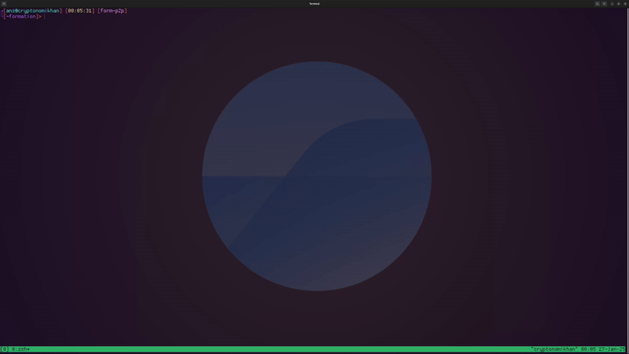

# Formation 

#### A public verfiable and self-replicating protocol for trustless confidential virtual private servers (VPS), coordinating as a Fog Compute network to power the Age of Autonomy.

<hr>

## Special Thanks

>"If I have seen further, it is by standing on the shoulders of giants" - Sir Isaac Newton 

This project leans heavily on the great work from [Rust-VMM](https://github.com/rust-vmm), [Cloud-Hypervisor](https://github.com/cloud-hypervisor/cloud-hypervisor), [Innernet](https://github.com/tonarino/innernet) and [DStack-VM](https://github.com/amiller/dstack-vm) without which the timeline for this project would have extended many more years.

## Contributing to Formation

As an Open Source project, we not only encourage, but rely on you to contribute to the project. Before you begin contributing please be sure to read, in full, the CONTRIBUTING file in this repository.

### WARNING! 
<hr>

<p> This project is still very early in its development. While it is inching closer to being production ready, there are no guarantees made. Please report issues here in the primary repository.
</p>

## Running a Node

Currently Formation is only known to work out of the box on Ubuntu 22.04, and the documentation provided herein assumes you are running Ubuntu 22.04. 

<hr>

#### Setting up local network configuration

Before launching Formation, you will want to ensure that your network and machine's network interface configuration is set up properly to run the protocl.

First and foremost, you will want to have the ports related to the various systems service APIs exposes/forwarded to your machine. 

Different routers and ISPs handle port forwarding differently, so we suggest you search the web for router and ISP specific instructions.

The default ports that the system's service APIs run on are:

`51820` for `formnet` join requests API

`3002` for `form-vmm` API

`3003` for `form-pack-manager` API

and 

`51820` for `formnet` interface.


You will also need a primary bridge network, currently, it must be called `br0` 
though in a future release this will become configurable, however, having
the primary bridge interface called `br0` is best practice. 

Ensure that you have a `br0` primary bridge interface set up on you machine, and 
ensure that your bridge is the master to your primary physical interface 
(eth0, enp3s0, or similar)

Once you have ensured your bridge interface exists and is `up` you can add
the physical interface to the bridge with the `brctl` command below

```bash
sudo brctl addif br0 <inet>
```

replace `<inet>` with the correct name of your physical interface.


In order to make this process easy for you, we have provided a script in this repo

`./scripts/validate_network_config.sh`


By running this script, assuming you do not have significant amounts of customized networking on the 
machine you are running Formation on, you should get a properly configured network and be able to move forward.

If you do not follow these steps, it is very likely that VPS instances launched by Formation
will not have internet access, will not be able to join formnet, and will not be able to be accessed by 
the developer that owns and manages the instances.

<hr>

There are a few different ways that you can run a Formation node and participate in the network. For full documentation see our [Official Docs](docs.formation.cloud), and navigate to the **Operators** section.

The easiest way to get started is to simply run our Docker image in privileged mode with --network=host.

First, you will need to build an Operator config file:

```bash
form kit operator config
```

This will walk you through a wizard, which will ask a series of questions. If you a running a single node developer network
or joining the official devnet using the official docker images, you will likely want to select all of the defaults.



Currently, ports related to service apis are hardcoded in many places throughout the system components, and as such,
we as you for the time being to only use the default ports, unless you are actively contributing to the project
and making changes to this default.

The reason for this, for now, is that different identification information does not currently include service ports for external facing services,
and in many cases, right now, due to the age of the project, we haven't gotten around to making internal service API ports configurable.
if you would like to contribute to this, please see [#16](https://github.com/formthefog/formation/issues/16)

Second, you will need to pull the official images:

```bash
# Pull formation-minimal 

First you will need to pull the 
docker pull cryptonomikhan/formation-minimal

# Retag it
docker tag cryptonomikhan/formation-minimal formation-minimal

# Pull form-build-server
docker pull cryptonomikhan/form-build-server

# Retag it
docker tag cryptonomikhan/form-build-server form-build-server
```

Then you can run it, ensure you use the `--privileged` flag `--network=host` and
provide it with the necessary devices and volumes (`/lib/modules` & `/var/run/docker.sock`)

You will also need to provide a volume/mount for the operator config, which contains
your secret key or mnemonic phrase, which is used to derive your identification,
and is used to sign messages to ensure authenticity.

You will then want to ensure that you also provide the path to the operator
config file as an environment variable inside the container.

If you chose to provide a password for the encryption of your keys in the config
file (currently required, though will not be in the near future) you will
want to provide the password as an environment variable as well.

```bash
docker run --rm --privileged --network=host \
    --device=/dev/kvm \
    --device=/dev/vhost-net \
    --device=/dev/null \
    --device=/dev/zero \
    --device=/dev/random \
    --device=/dev/urandom \
    -v /lib/modules:/lib/modules:ro \
    -v /var/run/docker.sock:/var/run/docker.sock \
    -v /path/to/config:/path/to/secrets \
    -e SECRET_PATH=/path/to/config \
    -e PASSWORD=<your-encryption-password> \
    --mount type=tmpfs,destination=/dev/hugepages,tmpfs-mode=1770 \
    -dit formation:latest
```

The **Formation** docker image requires that it be run in *privileged* mode, and while privileged mode is outside the scope of this particular document, we highly suggest you take the time to understand the implications of such. 

It also requires that you provide the `kvm` device and other devices, as it 
needs access to host hypervisor and devices to run virtual machines, some of 
these are likely able to be left out, but as best practice, and for the sake 
of thoroughness and the reduction of operator headaches, we suggest that you do 
provide the devices, as well as the hosts kernel modules to the container, 
as the Formation Virtual Machine Manager, Monitors and Hypervisor 
relies on KVM & other devices under the hood. 

Lastly, for now, we highly suggest your run it with the host network. 
The way that Formation provisions developers secure, confidential access 
to their instances is over a private VPN tunnel mesh network that runs 
wireguard under the hood. Configuring public access to the mesh network 
over the docker bridge network is still experimental, and you are likely to 
run into some headaches as a result. If you're looking to contribute to the 
project, and have expertise in container networking, linux networking, and 
would like to help make this process simpler so that the Formation node 
image can run without the host network access, please see the 
**Contributing to Formation** section above.

Running the image as described above will bootstrap you into an unofficial developer network. To join the official devnet please join our discord, navigate to the **Operators channel** and reach out to the core team there for more information on how to participate. 

### Run Single Node Local Test
<hr>

For a single node local test, we provide the `formation-minimal` docker image.

`formation-minimal`, unlike the `formation` image, does not provide the form-p2p
service, and therefore is not able to connect to the broader network. Further, `formation-minimal` does not register the node running it with the orchestration smart contract, and is therefore unable to be bootstrapped into the network, or verify the workloads it is responsible for. 

Nonetheless, it is valuable, as an operator or developer, to run locally for testing purposes, and makes the process of contributing to the protocol easier, faster, and more convenient. It also provides a minimal test environment for app developers planning to deploy to the broader network, and allows them to test their applications in a more production like scenario before deploying.

Similar to the formation image, you do need to provide `formation-minimal` with `kvm`, it does need to run in privilege mode, it still needs access to the docker socket, however, given that it is designed for a local test network it may not be necessary to run it on the host network, unless you plan on attempting to access instances or applications from a different machine or network.

To run a single local formation node, run the following command:

```bash
docker run --rm --privileged --network=host \
    --device=/dev/kvm \
    --device=/dev/vhost-net \
    --device=/dev/null \
    --device=/dev/zero \
    --device=/dev/random \
    --device=/dev/urandom \
    -v /lib/modules:/lib/modules:ro \
    -v /var/run/docker.sock:/var/run/docker.sock \
    -v /path/to/operator/config \ 
    -v /path/to/config:/path/to/secrets \
    -e SECRET_PATH=/path/to/config \
    -e PASSWORD=<your-encryption-password> \
    --mount type=tmpfs,destination=/dev/hugepages,tmpfs-mode=1770 \
    -dit formation-minimal:latest

```

<hr>

### Run Multinode Local Test 

<hr>

To run multiple local nodes, effectively building a localized test network, you will want to run the complete `formation` image, but you will have to do so on the docker bridge network or a custom docker network, which means that in order to gain access to instances, applications and nodes on the network from outside the local machine & network, you will need to set up port forwarding on the router, and customized rules in the local machines networking configuration.

<hr>

##### Join Official Developer Network

<hr>

To join the official developer network, we suggest you avoid using the docker images, and instead run the full suite of services on a clean ubuntu 22.04 installation, on hardware with a bare minimum of 32 physical cores, 64 GB of RAM, and at least 8TB of storage, though much more storage is preferred in order to enable larger workloads and applications with significantly larger data requirements. 

To participate as an official developer network node, join our [discord]() navigate
to the operator channel, and let our core team know you would like to participate as a devnet node operator. The devnet operator cohort is small, and is compensated, however there is a significant 
time commitment as the protocol will be iterated on, stopped and restarted frequently, and there will be coordinated live test scenarios that devnet operators will be asked to participate in,
all in an effort to ensure the network is hardened and ready for a more public and open testnet phase as the protocol will be iterated on, stopped and restarted frequently, and there will be coordinated live test scenarios that devnet operators will be asked to participate in,
all in an effort to ensure the network is hardened and ready for a more public and open testnet phase..

<hr>

## Initializing a Developer Kit

This is an optional, **but highly recommended**, step that will save you a lot of time and effort. The rest of the **Deploying an App** guide in here assumes you complete this step. If you choose not to complete this step, please see the [Official Docs](docs.formation.cloud) for CLI requirements, or use our [web-based deployments UI](dev.formation.cloud). 

From anywhere in your terminal run the following command:

```bash
form kit init
```

This will launch the init wizard. If you choose not to run the interactive wizard and simply answer each prompt to build your Formation dev kit, you can see our [Official Docs] for a list of CLI args or run `form kit --help` to see the optional and required arguments for the Formation dev kit.

## Deploying an App

```bash
cd /path/to/app/root
```

##### Build a `Formfile`
`Formfile` is the Formation networks equivalent to a `Dockerfile`, and they are intentionally very similar in syntax and purpose. 

Where `Dockerfile` defines a manifest or recipe for deterministically building a container image, Formfile does the same thing for both building and configuring a Formation VPS instance. Given the differences between containers and Linux Virtual Machines, there are some differences in the options and commands that you have at your disposal.

Below is an example of a simple `Formfile` that defines a minimal VPS instance for hosting a simple `hello-world` http server built in `python`. For full documentation see [Formfile Docs](docs.formation.cloud/formfile)

```Dockerfile
NAME hello-server

USER username:bigdog passwd:bigdog123 sudo:true

VCPU 1

MEM 512

DISK 5

COPY ./hello.py /app

INSTALL python3

WORKDIR /app

ENTRYPOINT ["python3", "/app/hello.py"]
```

##### Build a Formpack

After you have defined your `Formfile` in the project root, you can use the `form` CLI to validate your `Formfile` 

```bash
form pack validate
```
 Once validated, you can use the same CLI to request your app be built into a `Formpack`

```bash
form pack build .
```

This will package together your application artifacts based on the `Formfile`. If the `Formfile` is absent of any `COPY` instructions, the `Formpack` builder assumes that you want the entire directory (excluding the `Formfile`) to be include in your instance. To avoid this (a scenario where you will be cloning your application repo from github for example), you must have a `NOCOPY` command on one of the lines before the `ENTRYPOINT` command in the `Formfile`

Once your `Formpack` has successfully been built (i.e. you receive an API response with a `Formpack` ID from the CLI call), you can `ship` your `Formpack` to the network using the same CLI tool
```bash
form pack ship 
```

This process may take up to 5 minutes, you can `poll` the network for the status of your deployment with the `form manage` CLI tool. 

```bash
form manage get status <formpack-id>
```

This will return the state of the deployment (`PENDING`, `SUCCESS`, `FAILURE { reason: <some error message }`)

If your deployment is successful (which it should be, with very few exceptions).

If you run into an issue, please report it via github issues or join our discord where you can engage the core team.

<hr>

## Accessing your Instance

After you have successfully deployed an instance to our network, if you either:

- Provided a password as part of a Formfile `USER` command set `ssh_pwauth` to `true` 

&nbsp;&nbsp;&nbsp;&nbsp;&nbsp;&nbsp;&nbsp;OR

- provided an ssh key as part of a Formfile `USER` command under the `ssh_authorized_keys`

you will be able to gain full, secure access your instance over `ssh`.


There are 2 different ways to access your instance over `ssh`

1. If you chose to permanently join the formnet mesh when initializing your form dev kit, you can simply user
your favorite or any standard `ssh` tool, and provide one of the IP addresses
of your instance replicas. You can also set up DNS within formnet and use the domain name {{name}}.dev.formation.cloud
to access your instance via ssh
```bash
ssh <username>@10.128.0.54
```
OR

```bash
ssh <username>@<app-name>.dev.formation.cloud
```

2. Alternatively, if you did not choose to join the formnet mesh permanently, or at all, you can use the
`form ssh` command.

```bash
form ssh <username>@10.128.0.54
```

OR

```bash
form ssh <username>@<app-name>.dev.formation.cloud
```

Any of these options will allow you to gain secure ssh access to your instances.
SSH Access to instances deployed to the Formation network always happens over a secure, end to end encrypted VPN tunnel via formnet
not only do you gain the security of ssh, but another layer of security is provided via the VPN tunnel, given that these instances are hosted by untrusted, non-permissioned nodes in the network. This makes snooping on your ssh packets impossible, as the requesst does not get routed "through" the host, but rather through the VPN tunnel over the mesh network, which uses wireguard underneath the hood.

<hr>

## Committing Changes to an Instance or Application

One of the great features of the Formation network is that the instances in the network offer auto-redundancy and self replication, however, changes made to an instance via ssh or other forms of console access do not automatically get mirrored to redundant copies (yet). In order to ensure all of your replicas are in sync, it is required that after making changes during an ssh or console session, you `commit` the changes using the `form commit` command.

```bash
form commit 10.128.0.54
```

This will make a call to a small agent running inside the instance that will then inform the host's VMM service that it has been altered, and the developer wishes to commit these changes to the replicas. 

In the future, this will be phased out and replaced with an auto-replication process to enhance the developer experience, and the resiliency of the applications deployed to our network, however this feature is not included in the current release.

<hr>

## Roadmap

#### **COMING SOON**

<hr>
