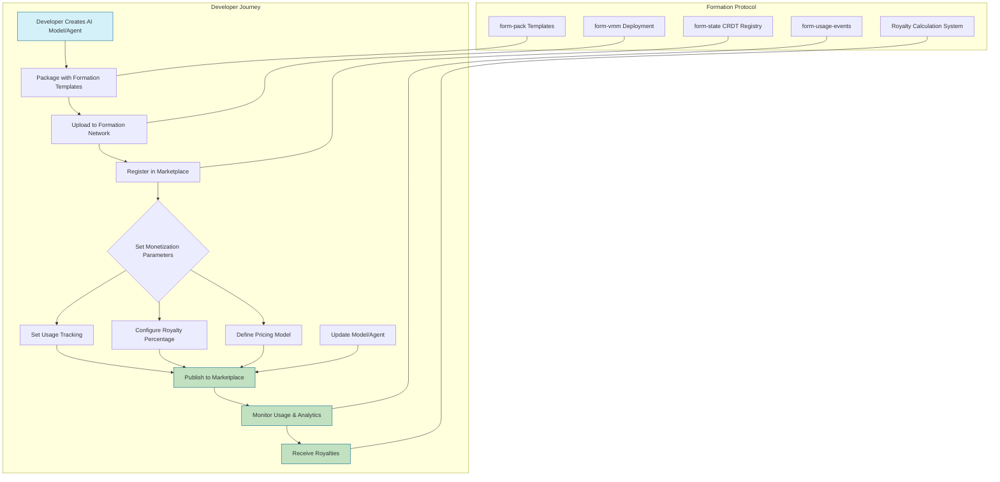
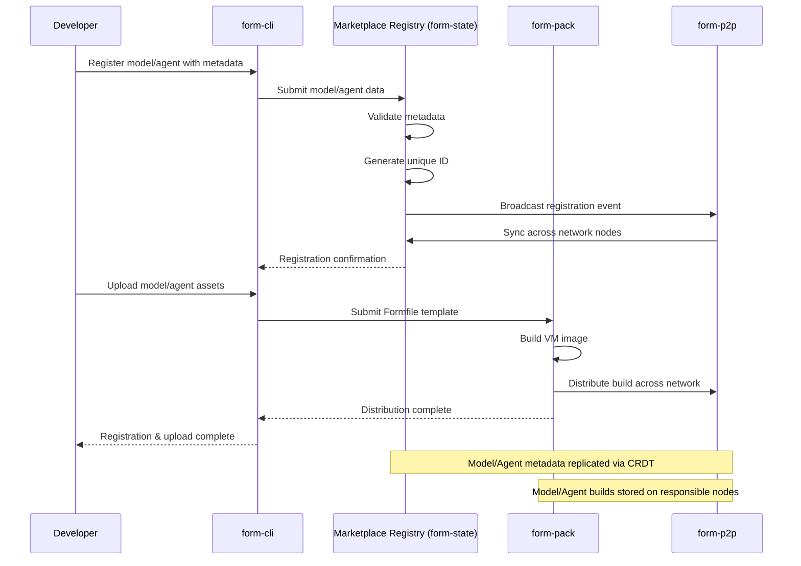
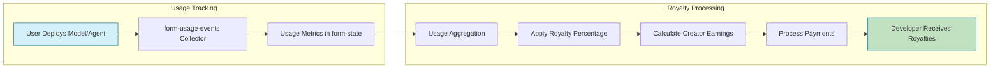
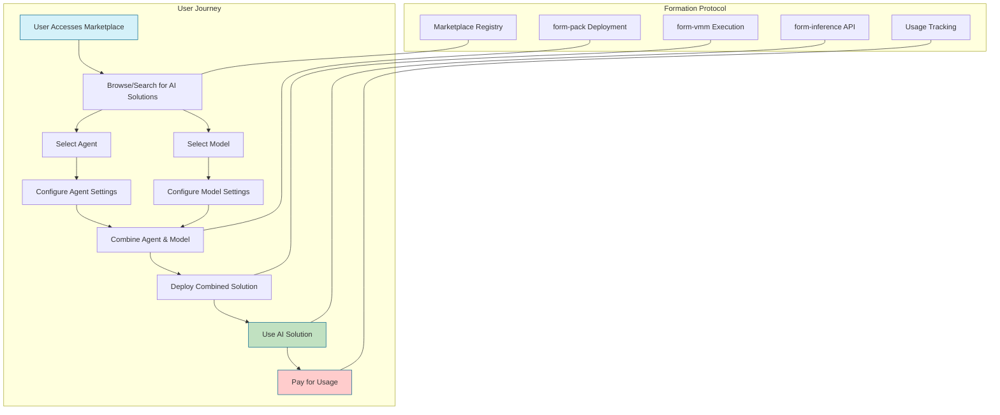
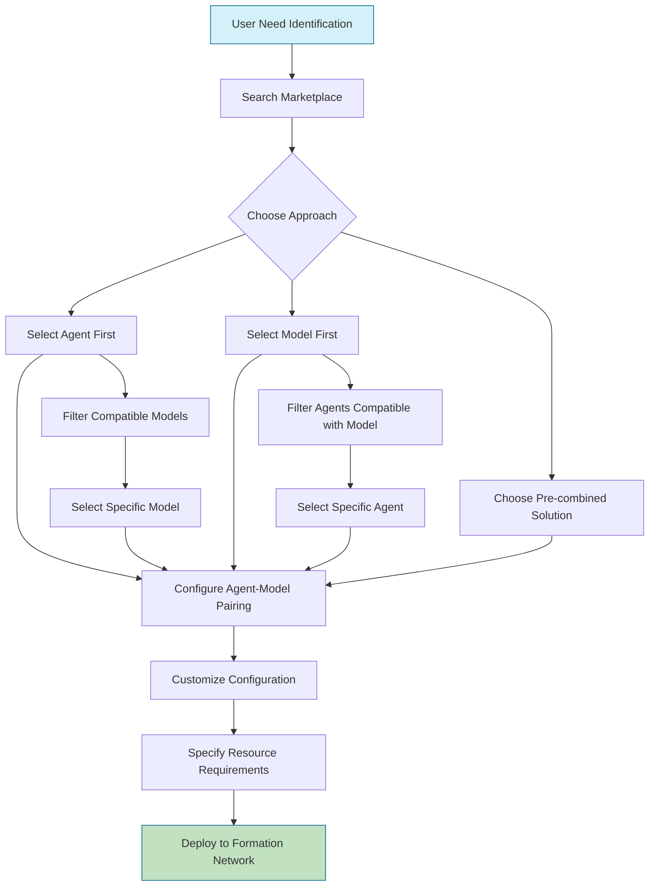
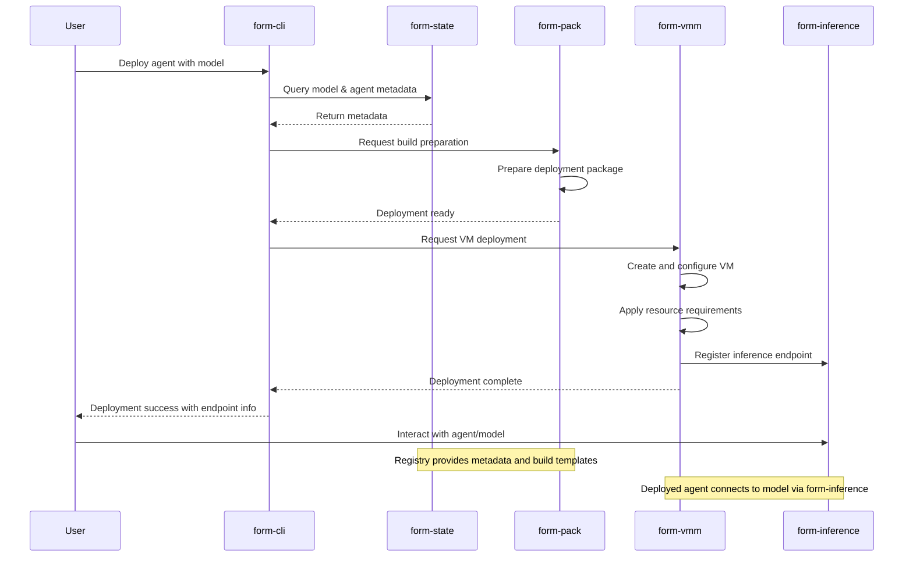
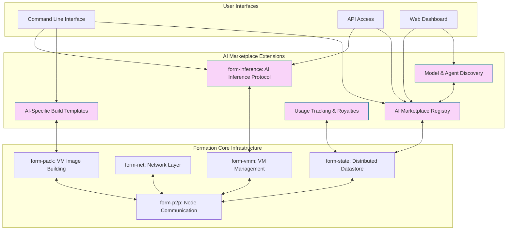

# AI Marketplace Flow Diagrams

This document contains high-level flow diagrams for the Formation AI Agent and Model Marketplace, illustrating how developers can register and monetize their AI models/agents, and how users can discover, select, and deploy them.

## Developer Registration and Monetization Flow

### Detail: Model/Agent Registration Process

### Detail: Revenue & Royalty System

## User Discovery and Deployment Flow

### Detail: Agent & Model Selection Process

### Detail: Deployment Sequence

## AI Marketplace Architecture Overview

This diagram shows how the AI Marketplace components (in purple) extend the core Formation infrastructure, providing AI-specific functionality while building on the existing distributed computing capabilities. 
