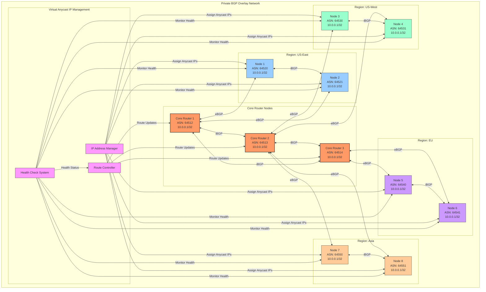

# BGP Overlay Design

This diagram shows the private BGP network topology, including ASN allocation, route propagation, and virtual Anycast IP allocation.

```mermaid
graph TB
    subgraph "Private BGP Overlay Network"
        subgraph "Core Router Nodes"
            CR1[Core Router 1<br>ASN: 64512<br>10.0.0.1/32]
            CR2[Core Router 2<br>ASN: 64513<br>10.0.0.1/32]
            CR3[Core Router 3<br>ASN: 64514<br>10.0.0.1/32]
        end
        
        subgraph "Region: US-East"
            N1[Node 1<br>ASN: 64520<br>10.0.0.1/32]
            N2[Node 2<br>ASN: 64521<br>10.0.0.1/32]
        end
        
        subgraph "Region: US-West"
            N3[Node 3<br>ASN: 64530<br>10.0.0.1/32]
            N4[Node 4<br>ASN: 64531<br>10.0.0.1/32]
        end
        
        subgraph "Region: EU"
            N5[Node 5<br>ASN: 64540<br>10.0.0.1/32]
            N6[Node 6<br>ASN: 64541<br>10.0.0.1/32]
        end
        
        subgraph "Region: Asia"
            N7[Node 7<br>ASN: 64550<br>10.0.0.1/32]
            N8[Node 8<br>ASN: 64551<br>10.0.0.1/32]
        end
        
        subgraph "Virtual Anycast IP Management"
            IPAM[IP Address Manager]
            HC[Health Check System]
            RTC[Route Controller]
        end
    end
    
    %% Core router connections
    CR1 <-->|iBGP| CR2
    CR2 <-->|iBGP| CR3
    CR3 <-->|iBGP| CR1
    
    %% US-East connections
    CR1 <-->|eBGP| N1
    CR1 <-->|eBGP| N2
    N1 <-->|iBGP| N2
    
    %% US-West connections
    CR2 <-->|eBGP| N3
    CR2 <-->|eBGP| N4
    N3 <-->|iBGP| N4
    
    %% EU connections
    CR3 <-->|eBGP| N5
    CR3 <-->|eBGP| N6
    N5 <-->|iBGP| N6
    
    %% Asia connections
    CR2 <-->|eBGP| N7
    CR2 <-->|eBGP| N8
    N7 <-->|iBGP| N8
    
    %% Management connections
    IPAM -->|Assign Anycast IPs| N1
    IPAM -->|Assign Anycast IPs| N2
    IPAM -->|Assign Anycast IPs| N3
    IPAM -->|Assign Anycast IPs| N4
    IPAM -->|Assign Anycast IPs| N5
    IPAM -->|Assign Anycast IPs| N6
    IPAM -->|Assign Anycast IPs| N7
    IPAM -->|Assign Anycast IPs| N8
    
    HC -->|Monitor Health| N1
    HC -->|Monitor Health| N2
    HC -->|Monitor Health| N3
    HC -->|Monitor Health| N4
    HC -->|Monitor Health| N5
    HC -->|Monitor Health| N6
    HC -->|Monitor Health| N7
    HC -->|Monitor Health| N8
    
    HC -->|Health Status| RTC
    RTC -->|Route Updates| CR1
    RTC -->|Route Updates| CR2
    RTC -->|Route Updates| CR3
    
    classDef core fill:#f96,stroke:#333,stroke-width:2px;
    classDef useast fill:#9cf,stroke:#333,stroke-width:1px;
    classDef uswest fill:#9fc,stroke:#333,stroke-width:1px;
    classDef eu fill:#c9f,stroke:#333,stroke-width:1px;
    classDef asia fill:#fc9,stroke:#333,stroke-width:1px;
    classDef mgmt fill:#f9f,stroke:#333,stroke-width:1px;
    
    class CR1,CR2,CR3 core;
    class N1,N2 useast;
    class N3,N4 uswest;
    class N5,N6 eu;
    class N7,N8 asia;
    class IPAM,HC,RTC mgmt;
``` 