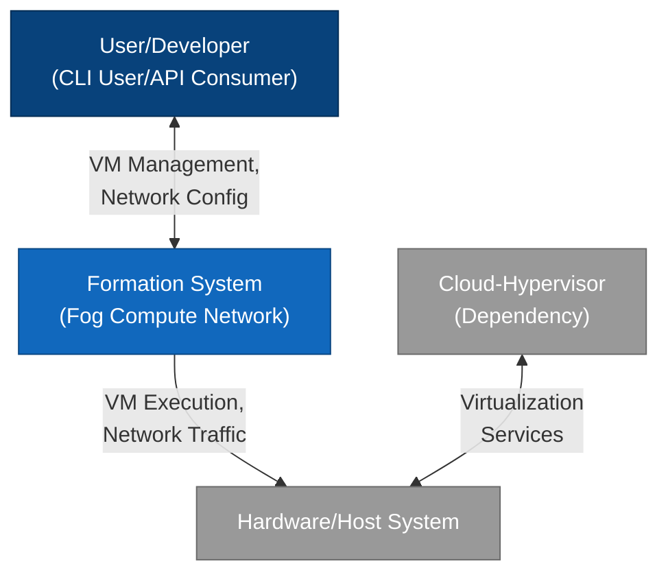
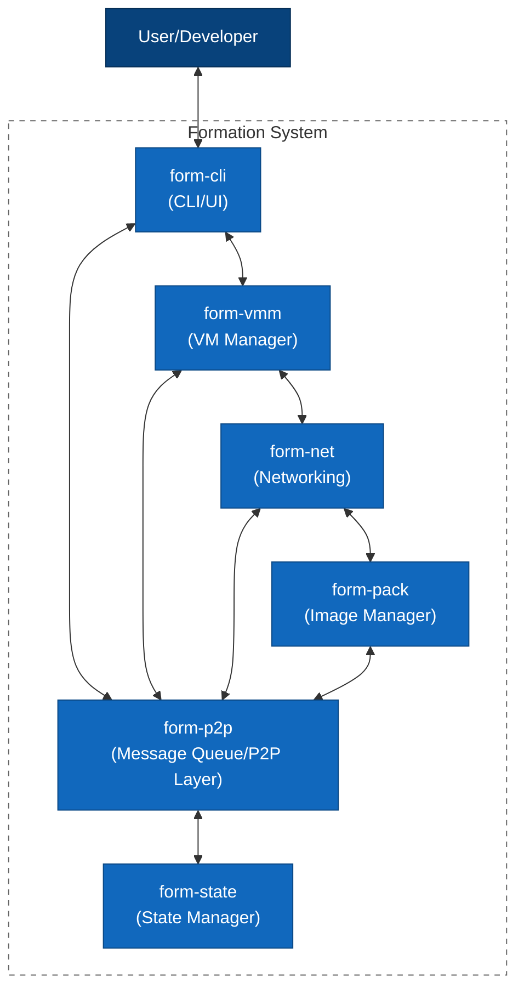
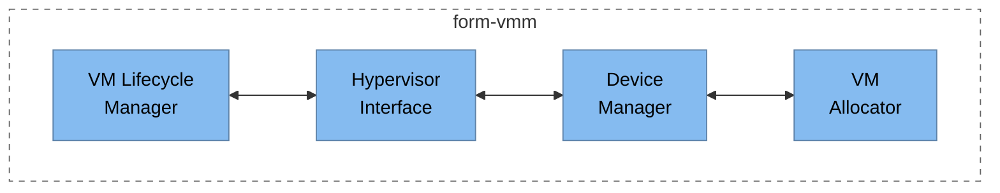
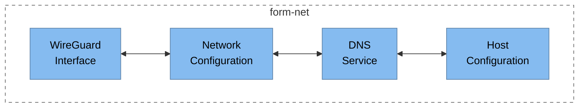
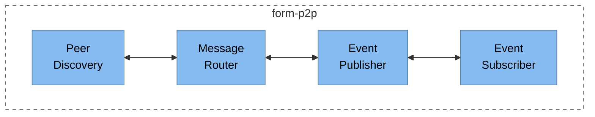
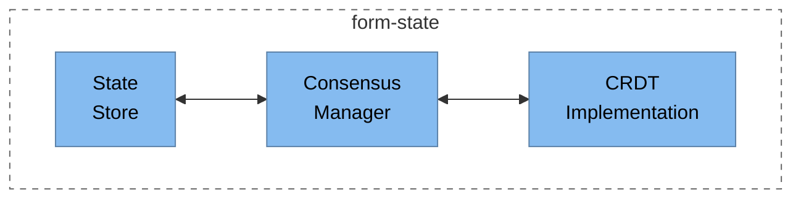
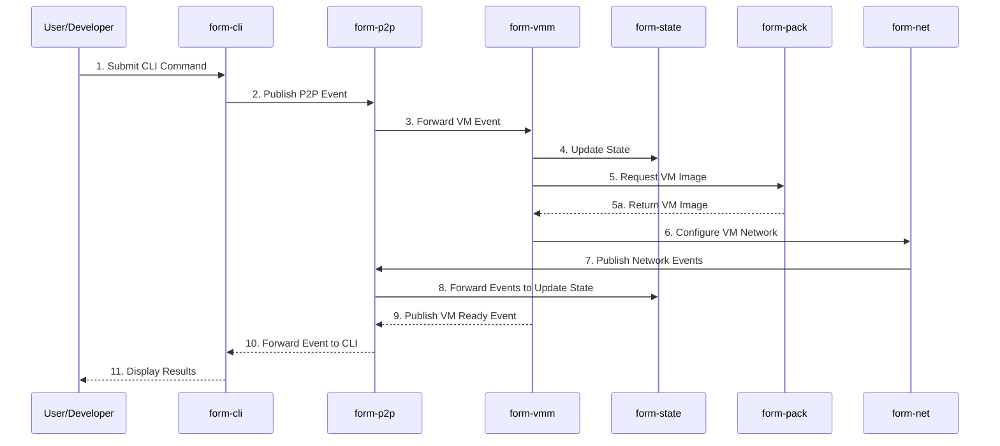
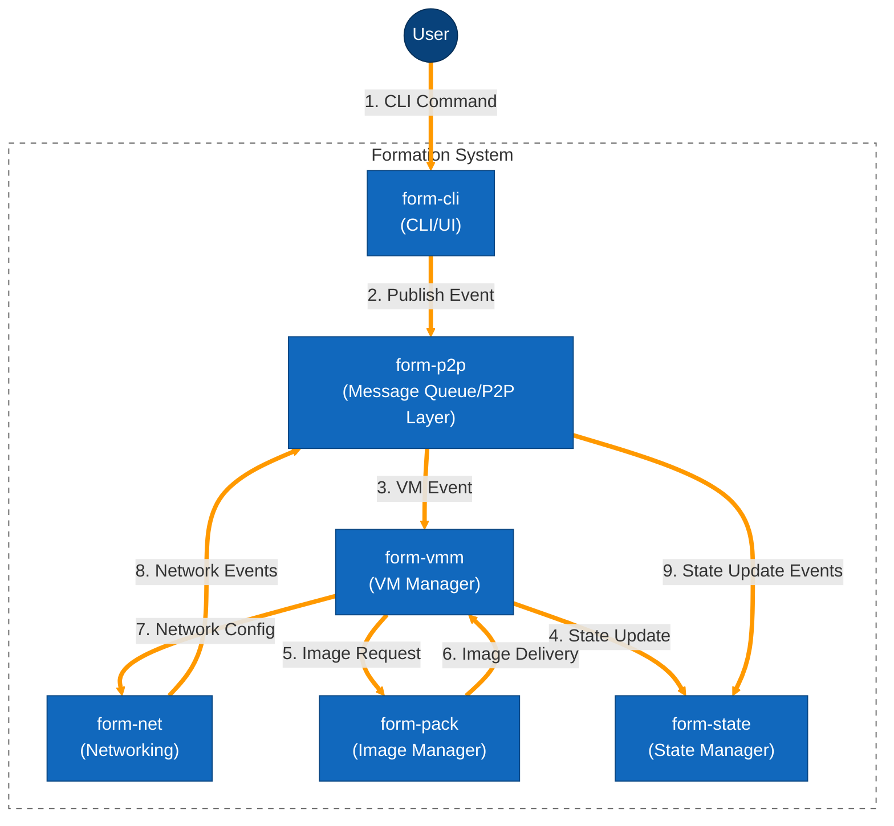

# Formation System - C4 Architecture Model

This document provides an overview of the C4 architectural model for the Formation system with all diagrams included inline.

## What is C4?

The C4 model is a lightweight approach to software architecture documentation created by Simon Brown. It uses a hierarchical set of diagrams to describe different levels of abstraction:

1. **Context** - System context and interactions with users and other systems
2. **Containers** - High-level technology components that make up the system
3. **Components** - Individual application components within containers
4. **Code** - Code-level details (classes, interfaces, etc.)

## Formation C4 Diagrams

The Formation system architecture is documented using the following C4 diagrams:

### Level 1: Context

This diagram shows the Formation system in its environment, including users and external systems that interact with it.

This context diagram illustrates:

- **User/Developer**: Interacts with the Formation system through CLI commands and API calls
- **Formation System**: The core fog compute network that manages virtual machines and networking
- **Hardware/Host System**: The underlying physical infrastructure that hosts Formation
- **Cloud-Hypervisor**: The dependency that Formation uses for VM management

All communication between components is shown with annotated arrows that describe the nature of the interaction.

### Level 2: Containers

This diagram breaks down the Formation system into its major components (containers) and shows how they interact.

This container diagram illustrates the main components of the Formation system:

- **form-cli**: The command-line interface and user interaction layer
- **form-vmm**: Virtual machine manager based on Cloud Hypervisor
- **form-net**: Network management based on WireGuard
- **form-pack**: VM image management and packaging
- **form-p2p**: Peer-to-peer messaging system that acts as a message queue
- **form-state**: Distributed state management with BFT-CRDT

The arrows show the communication paths between components, primarily flowing through the form-p2p layer which serves as the central messaging bus for the system. Components can also communicate directly via API calls when immediate responses are needed.

### Level 3: Components

These diagrams detail the internal components of the major containers in the Formation system.

#### form-vmm Components

#### form-net Components

#### form-p2p Components

#### form-state Components

These component diagrams illustrate the internal structure of the main containers in the Formation system:

1. **form-vmm** - The Virtual Machine Manager with components for:
   - VM lifecycle management
   - Hypervisor interface
   - Device management
   - VM resource allocation

2. **form-net** - The Networking layer with components for:
   - WireGuard interface management
   - Network configuration
   - DNS services
   - Host network configuration

3. **form-p2p** - The Peer-to-Peer messaging layer with components for:
   - Peer discovery
   - Message routing
   - Event publishing
   - Event subscription

4. **form-state** - The State Management layer with components for:
   - State storage
   - Consensus management
   - CRDT (Conflict-free Replicated Data Type) implementation

### Level 4: Dynamic View

This diagram shows the dynamic flow of data and commands through the Formation system during a typical operation.

This sequence diagram illustrates the typical flow of creating and configuring a VM in the Formation system:

1. The user submits a command through the CLI
2. The CLI publishes an event to the P2P layer
3. The P2P layer forwards the VM-related event to the VMM
4. The VMM updates the system state with the pending VM creation
5. The VMM requests a VM image from the form-pack component
6. The form-pack component returns the requested VM image
7. The VMM configures networking for the VM via the form-net component
8. The form-net component publishes network events to the P2P layer
9. The P2P layer forwards events to update the system state
10. The VMM publishes a "VM Ready" event to the P2P layer when the VM is ready
11. The P2P layer forwards the event to the CLI
12. The CLI displays the results to the user

This diagram shows both synchronous calls (solid arrows) and asynchronous message returns (dashed arrows).

### Animated Data Flow

This diagram illustrates the event flow through the Formation system with highlighted paths to simulate animation.

This diagram shows the flow of data through the Formation system with highlighted pathways to simulate animation:

1. The user initiates the process by submitting a CLI command
2. The command is published as an event to the P2P messaging layer
3. The P2P layer routes the event to the VMM (Virtual Machine Manager)
4. The VMM updates the state in the form-state component
5. The VMM requests a VM image from the form-pack component
6. The form-pack component delivers the VM image back to the VMM
7. The VMM configures networking through the form-net component
8. The form-net component sends network events to the P2P layer
9. The P2P layer forwards events to update the system state

The highlighted orange paths (using thicker lines and a distinct color) create a visual representation of the data flow, showing how events and commands propagate through the system.

## Key Insights from the C4 Analysis

The C4 model reveals several key architectural aspects of the Formation system:

1. **Event-Driven Architecture**: The system primarily uses asynchronous events flowing through the form-p2p message queue.

2. **Layered Design**: Clear separation between VM management, networking, state management, and user interface components.

3. **Distributed Processing**: Components are designed to work in a distributed environment, with state consistency maintained through the form-state component.

4. **Technology Foundation**: Built on established technologies like Cloud Hypervisor for VM management and WireGuard for networking.

5. **Peer-to-Peer Communication**: The form-p2p component provides a decentralized communication backbone for the entire system, with direct API calls used when immediate responses are needed.

## How to Use These Diagrams

These diagrams are created using Mermaid, a markdown-based diagramming tool. To render them:

1. View the markdown files in a Mermaid-compatible renderer
2. Copy the Mermaid code blocks into an online Mermaid Live Editor (https://mermaid.live)
3. Integrate them into documentation using Mermaid support in tools like GitHub, GitLab, or documentation generators

## Future Enhancements

The C4 model could be extended with:

1. More detailed component diagrams for additional containers
2. Code-level diagrams (Level 4) for critical components
3. Additional sequence diagrams for other common operations
4. Deployment diagrams showing how components are distributed in a production environment 