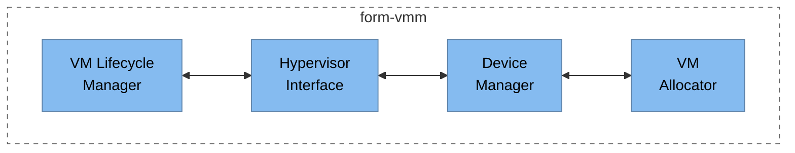
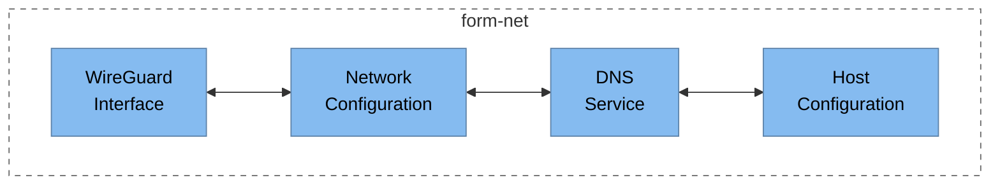
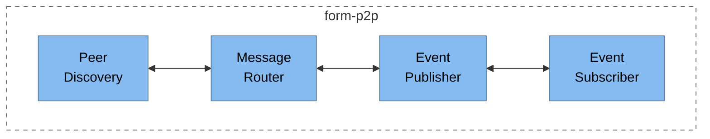
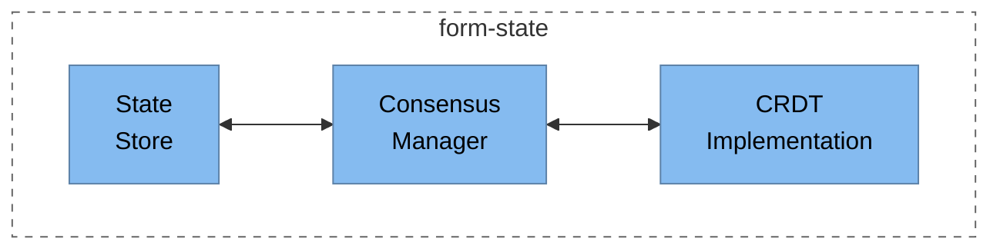

# Formation System - C4 Component Diagrams (Level 3)

This file contains component-level diagrams for the main containers in the Formation system.

## form-vmm Components

## form-net Components

## form-p2p Components

## form-state Components

## Description

These component diagrams illustrate the internal structure of the main containers in the Formation system:

1. **form-vmm** - The Virtual Machine Manager with components for:
   - VM lifecycle management
   - Hypervisor interface
   - Device management
   - VM resource allocation

2. **form-net** - The Networking layer with components for:
   - WireGuard interface management
   - Network configuration
   - DNS services
   - Host network configuration

3. **form-p2p** - The Peer-to-Peer messaging layer with components for:
   - Peer discovery
   - Message routing
   - Event publishing
   - Event subscription

4. **form-state** - The State Management layer with components for:
   - State storage
   - Consensus management
   - CRDT (Conflict-free Replicated Data Type) implementation 