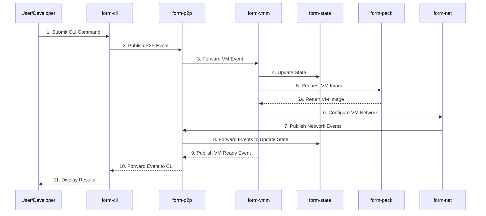

# Formation System - C4 Sequence Diagram (Level 4)

This diagram shows the dynamic flow of data and commands through the Formation system.

## Description

This sequence diagram illustrates the typical flow of creating and configuring a VM in the Formation system:

1. The user submits a command through the CLI
2. The CLI publishes an event to the P2P layer
3. The P2P layer forwards the VM-related event to the VMM
4. The VMM updates the system state with the pending VM creation
5. The VMM requests a VM image from the form-pack component
6. The form-pack component returns the requested VM image
7. The VMM configures networking for the VM via the form-net component
8. The form-net component publishes network events to the P2P layer
9. The P2P layer forwards events to update the system state
10. The VMM publishes a "VM Ready" event to the P2P layer when the VM is ready
11. The P2P layer forwards the event to the CLI
12. The CLI displays the results to the user

This diagram shows both synchronous calls (solid arrows) and asynchronous message returns (dashed arrows). 