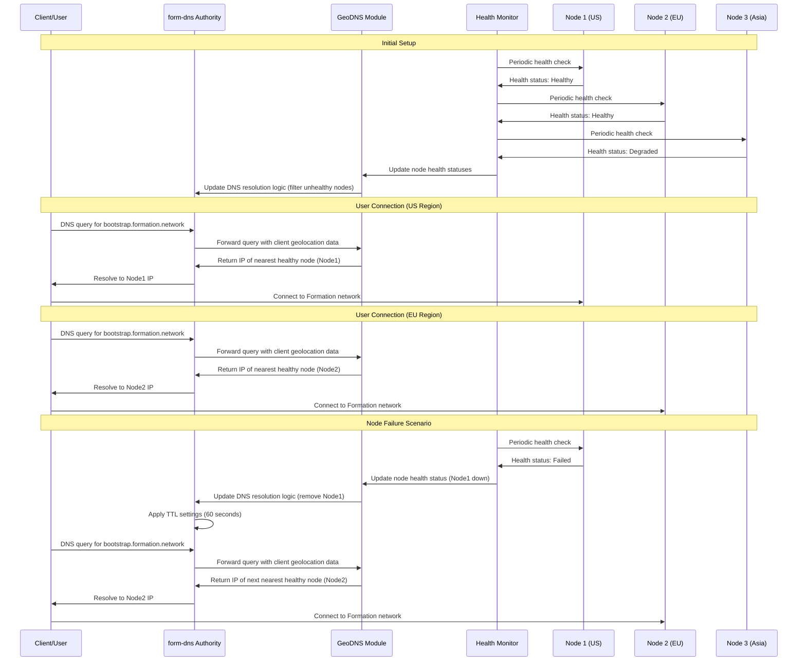

# DNS Routing Flow

This diagram illustrates the DNS-based routing flow using the internal form-dns system, including geographic resolution, health checks, and how clients connect to the nearest healthy node.

