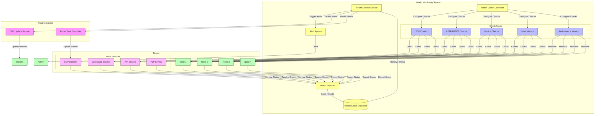

# Health Monitoring System

This diagram depicts the health monitoring architecture, including health checks, reporting flow, and how health status affects routing decisions.

```mermaid
flowchart TB
    subgraph "Health Monitoring System"
        HM[Health Monitor Service]
        HC[Health Check Controller]
        HR[Health Reporter]
        DB[(Health Status Database)]
        AL[Alert System]
        
        subgraph "Check Types"
            TCP[TCP Checks]
            HTTP[HTTP/HTTPS Checks]
            SVC[Service Checks]
            LOAD[Load Metrics]
            PERF[Performance Metrics]
        end
    end
    
    subgraph "Nodes"
        N1[Node 1]
        N2[Node 2]
        N3[Node 3]
        N4[Node 4]
        subgraph "Node Services"
            WG[WireGuard Service]
            API[API Service]
            P2P[P2P Service]
            BGP[BGP Daemon]
        end
    end
    
    subgraph "Routing Control"
        DNS[DNS Update Service]
        RT[Route Table Controller]
    end
    
    %% Health check flows
    HC -->|Configure Checks| TCP
    HC -->|Configure Checks| HTTP
    HC -->|Configure Checks| SVC
    HC -->|Configure Checks| LOAD
    HC -->|Configure Checks| PERF
    
    TCP -->|Check| N1
    TCP -->|Check| N2
    TCP -->|Check| N3
    TCP -->|Check| N4
    
    HTTP -->|Check| N1
    HTTP -->|Check| N2
    HTTP -->|Check| N3
    HTTP -->|Check| N4
    
    SVC -->|Check| WG
    SVC -->|Check| API
    SVC -->|Check| P2P
    SVC -->|Check| BGP
    
    LOAD -->|Collect| N1
    LOAD -->|Collect| N2
    LOAD -->|Collect| N3
    LOAD -->|Collect| N4
    
    PERF -->|Measure| N1
    PERF -->|Measure| N2
    PERF -->|Measure| N3
    PERF -->|Measure| N4
    
    %% Health data flow
    N1 -->|Report Status| HR
    N2 -->|Report Status| HR
    N3 -->|Report Status| HR
    N4 -->|Report Status| HR
    
    WG -->|Service Status| HR
    API -->|Service Status| HR
    P2P -->|Service Status| HR
    BGP -->|Service Status| HR
    
    HR -->|Store Results| DB
    DB -->|Retrieve Status| HM
    
    %% Action flows
    HM -->|Trigger Alerts| AL
    HM -->|Health Status| DNS
    HM -->|Health Status| RT
    
    DNS -->|Update Records| Internet
    RT -->|Update Routes| BGP
    
    AL -->|Alert| Admin
    
    classDef check fill:#bbf,stroke:#333,stroke-width:1px;
    classDef node fill:#bfb,stroke:#333,stroke-width:1px;
    classDef service fill:#fbf,stroke:#333,stroke-width:1px;
    classDef monitor fill:#ff9,stroke:#333,stroke-width:1px;
    classDef routing fill:#f9f,stroke:#333,stroke-width:1px;
    
    class TCP,HTTP,SVC,LOAD,PERF check;
    class N1,N2,N3,N4 node;
    class WG,API,P2P,BGP service;
    class HM,HC,HR,DB,AL monitor;
    class DNS,RT routing;
``` 