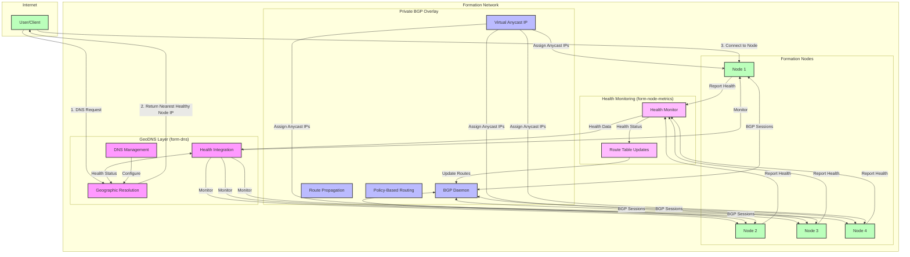

# High-Level Architecture

This diagram provides an overview of the virtual Anycast system architecture, showing how the form-dns GeoDNS implementation and the private BGP overlay work together within the Formation network.

