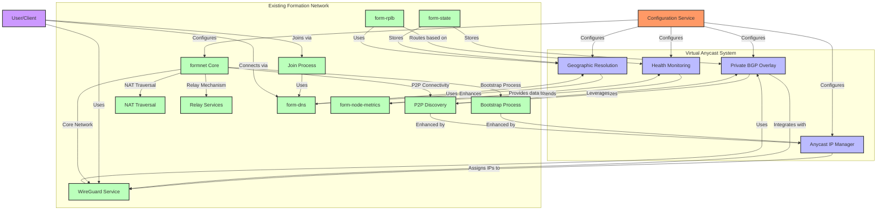

# Integration Points

This diagram visualizes how the virtual Anycast system integrates with the existing Formation network components, leveraging the form-dns, form-rplb, and form-state infrastructure.

