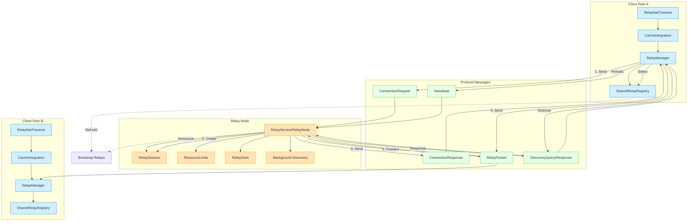

# Relay System Architecture

This document provides a visual representation of the Form-Net relay system architecture along with explanations of the key components and their interactions.

## System Overview

The relay system provides a decentralized TURN-like service that enables connections between peers when direct connections aren't possible due to NAT or firewall restrictions. It consists of several interconnected components that work together to provide reliable relay functionality.

## Architecture Diagram

## Component Interactions

### Connection Establishment Flow

1. **Discovery Phase**:
   - A client peer uses its `RelayRegistry` to discover available relay nodes.
   - The registry may refresh its list from bootstrap relays.
   - The `RelayManager` selects the best relay based on criteria like latency, reliability, and load.

2. **Connection Request**:
   - The client's `RelayManager` sends a `ConnectionRequest` to the selected relay.
   - The message includes the public keys of both the initiating peer and the target peer.

3. **Session Creation**:
   - The `RelayService` receives the request and creates a `RelaySession`.
   - The relay checks resource limits and authorization.
   - The relay assigns a unique session ID.

4. **Connection Response**:
   - The relay sends a `ConnectionResponse` back to the initiating peer.
   - If successful, the response includes the session ID.
   - The client stores this session information for future packets.

5. **Data Forwarding**:
   - The initiating peer sends data to the target peer using `RelayPacket`.
   - The relay authenticates the packet using the session information.
   - The relay forwards the packet to the target peer.
   - The target peer can respond through the same relay session.

6. **Session Maintenance**:
   - Peers send periodic `Heartbeat` messages to keep sessions alive.
   - The relay tracks session activity and expires inactive sessions.
   - The relay updates statistics on forwarded packets and bandwidth.

### NAT Traversal Integration

- The `RelayNatTraverse` class extends the standard NAT traversal mechanism.
- It attempts direct connections first and falls back to relay connections if needed.
- The `CacheIntegration` component tracks connection success and failure history.
- Based on past connection attempts, it determines when relay connections should be attempted.

### Relay Service Operation

- The `RelayService` listens for incoming UDP packets.
- It processes different message types and routes them appropriately.
- It enforces rate limits and resource constraints to prevent abuse.
- It maintains session state and cleans up expired sessions.
- The Background Discovery process periodically announces the relay to other relays.

## Adaptive Features

The relay system includes several adaptive features:

1. **Adaptive Timeouts**:
   - The `LatencyTracker` component monitors connection latency.
   - Timeout durations adjust based on observed network conditions.
   - This improves reliability in varying network environments.

2. **Reliability-Based Selection**:
   - Relays are scored based on past performance.
   - The scoring algorithm considers latency, packet loss, and success rate.
   - More reliable relays are prioritized for future connections.

3. **Automatic Fallback**:
   - The system attempts direct connections first.
   - It automatically falls back to relay connections when direct connections fail.
   - The fallback decision is based on connection history.

## Security Considerations

1. **Session Authentication**:
   - Relay sessions include authentication mechanisms.
   - Packets are validated to ensure they come from authorized peers.
   - Authentication tokens can be used for additional security.

2. **Resource Protection**:
   - Rate limiting prevents denial-of-service attacks.
   - Per-IP and global connection limits restrict abuse.
   - Session expiration ensures resources are freed when no longer needed.

3. **Traffic Validation**:
   - Timestamp checking prevents replay attacks.
   - Packet size limitations prevent resource exhaustion.
   - Session activity monitoring detects and removes inactive sessions. 