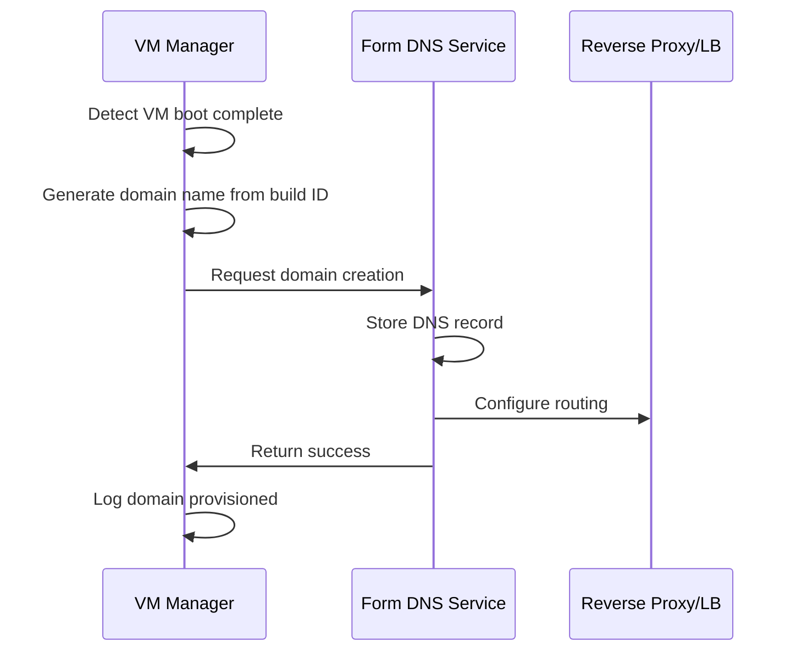
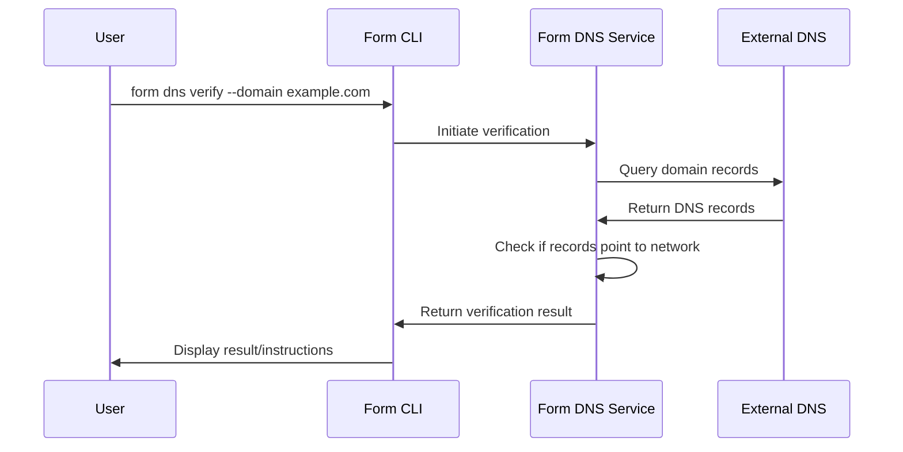

# DNS Architecture

This document provides a detailed overview of the DNS management system within Formation, including its architecture, components, and how they interact.

## System Overview

The Formation DNS system provides automated domain name management for VM instances, allowing both automatic provisioning of vanity domains and support for custom domains with ownership verification.

## Key Components

### 1. DNS Service (`form-dns`)

The DNS service is the core component responsible for:
- Managing DNS records
- Handling domain verification
- Interacting with the reverse proxy for routing
- Providing API endpoints for DNS management

**Key Files:**
- `form-dns/src/api.rs` - API endpoints for DNS management
- `form-dns/src/store.rs` - DNS record storage and management
- `form-dns/src/authority.rs` - Implementation of DNS authority

### 2. CLI Commands (`form-cli/src/dev/dns`)

The CLI component provides user-friendly commands for interacting with the DNS system:
- `add.rs` - Add new DNS records
- `update.rs` - Update existing DNS records
- `remove.rs` - Remove DNS records
- `verify.rs` - Verify ownership of custom domains

### 3. VM Manager Integration (`form-vmm/vmm-service/src/service/vmm.rs`)

The VM manager integrates with the DNS system to automatically provision domains when instances boot.

### 4. Reverse Proxy/Load Balancer (`form-rplb`)

Handles traffic routing based on DNS records and manages TLS certificates.

## Data Model

### FormDnsRecord Structure

```rust
pub struct FormDnsRecord {
    pub domain: String,
    pub record_type: RecordType,
    pub public_ip: Vec<SocketAddr>,
    pub formnet_ip: Vec<SocketAddr>,
    pub cname_target: Option<String>,
    pub ssl_cert: bool,
    pub ttl: u32,
    pub verification_status: Option<VerificationStatus>,
    pub verification_timestamp: Option<u64>,
}
```

### VerificationStatus Enum

```rust
pub enum VerificationStatus {
    Pending,
    Verified,
    Failed(String),
    NotVerified,
}
```

## Key Workflows

### 1. Automatic Domain Provisioning

When a VM instance completes booting:
1. The `VmManager.handle_vmm_event` method detects the `BootComplete` event
2. It generates a domain name based on the build ID (e.g., `build-id.fog`)
3. It calls the DNS API to create a new record
4. The DNS service stores the record and configures the reverse proxy
5. The VM instance is now accessible via the domain name

```rust
// Simplified example from vmm.rs
async fn handle_vmm_event(&mut self, event: &VmmEvent) -> Result<()> {
    match event {
        VmmEvent::BootComplete { instance_id, build_id, .. } => {
            // Generate domain name based on build ID
            let domain = format!("{}.fog", build_id);
            
            // Call DNS API to provision the domain
            // ...
        }
    }
}
```

### 2. Custom Domain Verification

When a user wants to verify a custom domain:
1. User runs `form dns verify --domain example.com`
2. The CLI sends a request to the verification API endpoint
3. The DNS service checks if the domain points to a network node
4. If verification succeeds, the domain status is updated to `Verified`
5. If verification fails, instructions are provided to the user

## API Endpoints

The DNS service exposes the following API endpoints:

```
POST /record/create - Create a new DNS record
PUT /record/{domain}/update - Update an existing DNS record
DELETE /record/{domain}/delete - Delete a DNS record
GET /record/{domain} - Get a DNS record
GET /records - List all DNS records
POST /record/{domain}/verify - Initiate domain verification
GET /record/{domain}/verify - Check domain verification status
```

## Integration Points

### 1. Integration with Instance Metadata

The domain information is stored in the `Instance` structure's `dns_record` field:

```rust
pub struct Instance {
    // Other fields...
    pub dns_record: Option<FormDnsRecord>,
    // Other fields...
}
```

### 2. Integration with VM Networking

DNS configuration is integrated with VM networking through:
- Domain-to-IP mappings
- Formnet IP addressing
- Reverse proxy configuration

## Security Considerations

1. **Domain Verification**
   - Prevents unauthorized use of domains
   - Ensures only domain owners can use their domains

2. **TLS Certificate Management**
   - Automatic TLS certificate provisioning for secure connections
   - Renewal and management handled by the DNS service

3. **Access Control**
   - Domain operations are authenticated and authorized

## Implementation Details

### DNS Record Storage

DNS records are stored in a distributed state system using CRDTs (Conflict-free Replicated Data Types) to ensure consistency across nodes.

```rust
pub struct DnsState {
    pub zones: Map<String, BFTReg<CrdtDnsRecord, Actor>, Actor>
}
```

### Domain Verification Process

Domain verification uses the `trust-dns-client` library to check if DNS records point to network nodes:

```rust
async fn check_domain_points_to_network(&self, domain: &str) -> Result<bool, String> {
    // Query external DNS servers for the domain's records
    // Check if the records point to our network nodes
    // Return true if verification successful
}
```

## Sequence Diagrams

### Automatic Domain Provisioning



### Domain Verification



## Limitations and Future Work

1. **Current Limitations**
   - Limited wildcard certificate support
   - No automated DNS propagation checking
   - No domain templates for organizations

2. **Future Improvements**
   - DNS propagation checking
   - Domain templates for consistent naming
   - Enhanced integration with VM networking
   - Advanced TLS certificate management

## Reference Documentation

- [DNS User Guide](../developer/guides/domain-configuration)
- [Formation Network Architecture](./index) 