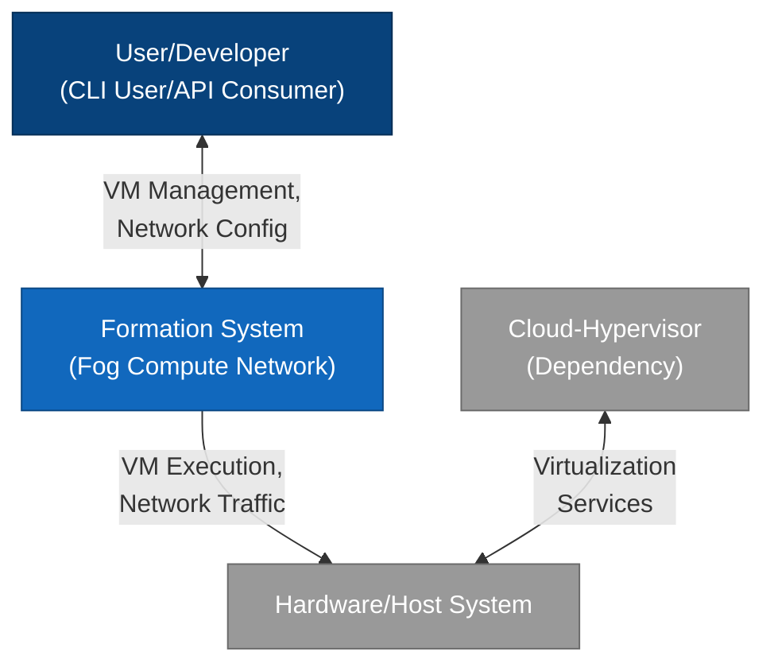
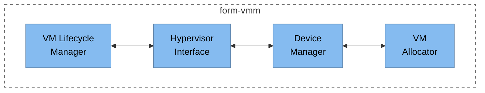
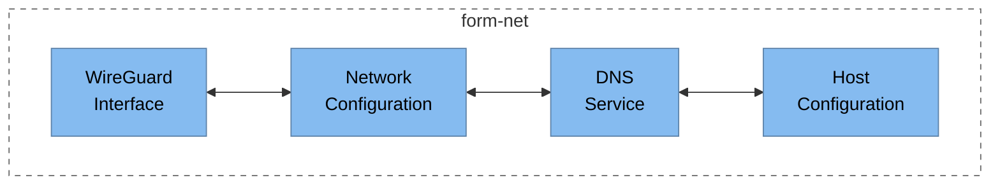
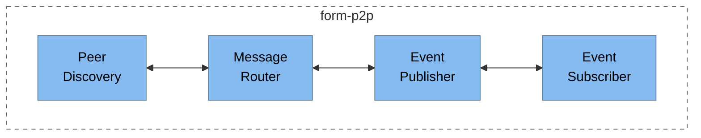
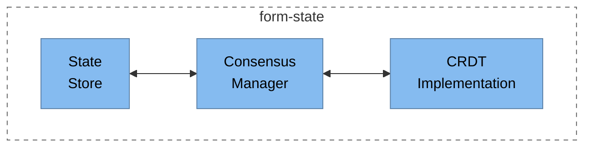
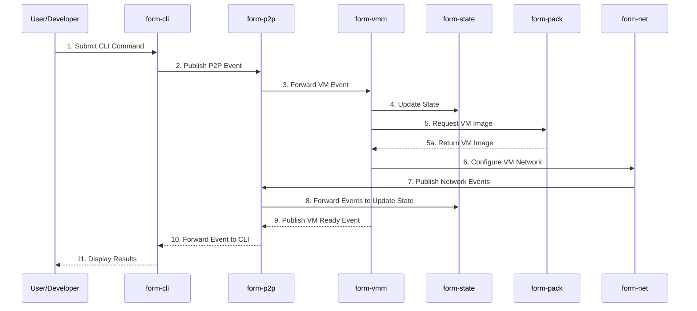
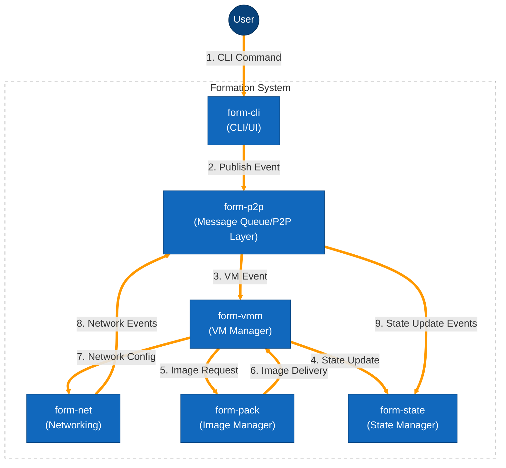

# Formation Architecture Overview

Formation is a public verifiable and self-replicating protocol for trustless, confidential virtual private servers (VPS) coordinating as a Fog Compute network. This document provides an in-depth overview of the system architecture and components.

## System Architecture Diagrams

### Level 1: System Context

The following diagram shows Formation in context, including its relationships with users and external systems:



This context diagram illustrates:

- **User/Developer**: Interacts with the Formation system through CLI commands and API calls
- **Formation System**: The core fog compute network that manages virtual machines and networking
- **Hardware/Host System**: The underlying physical infrastructure that hosts Formation
- **Cloud-Hypervisor**: The dependency that Formation uses for VM management

### Level 2: Container Architecture

This diagram shows the major components (containers) of the Formation system and their relationships:


This container diagram illustrates the main components of the Formation system:

- **form-cli**: The command-line interface and user interaction layer
- **form-vmm**: Virtual machine manager based on Cloud Hypervisor
- **form-net**: Network management based on WireGuard
- **form-pack**: VM image management and packaging
- **form-p2p**: Peer-to-peer messaging system that acts as a message queue
- **form-state**: Distributed state management with BFT-CRDT

### Level 3: Component Diagrams

These diagrams detail the internal components of the major containers in the Formation system:

#### form-vmm Components



#### form-net Components



#### form-p2p Components



#### form-state Components



### Level 4: Dynamic View (Sequence Diagrams)

This sequence diagram shows how the different components interact during a typical instance deployment operation:



This sequence diagram illustrates the typical flow when creating and configuring a VM in the Formation system.

### Data Flow Architecture

The following diagram illustrates the event flow through the Formation system:



This animated data flow diagram shows how commands and events propagate through the system, with highlighted orange paths representing the key flows.

## Deployment Architectures

Formation can be deployed in various configurations depending on requirements:

### Minimum Viable Deployment (3 Nodes)

A minimal Formation deployment consists of at least three nodes to provide basic fault tolerance and distributed operation:

```
Node 1 ◄───► Node 2
  ▲          ▲
  │          │
  ▼          ▼
         Node 3
```

Each node runs the full Formation stack, including VMM, state management, and networking.

### Standard Production Deployment (12+ Nodes)

For production environments, a larger deployment provides better resilience and load distribution:

```
                 ┌───────┐
                 │Gateway│
                 └───┬───┘
                     │
           ┌─────────┴─────────┐
           ▼         ▼         ▼
     ┌─────────┐┌─────────┐┌─────────┐
     │  Node 1 ││  Node 2 ││  Node 3 │
     └─────────┘└─────────┘└─────────┘
           ▲         ▲         ▲
           └─────────┼─────────┘
                     │
           ┌─────────┴─────────┐
           ▼         ▼         ▼
     ┌─────────┐┌─────────┐┌─────────┐
     │  Node 4 ││  Node 5 ││  Node 6 │
     └─────────┘└─────────┘└─────────┘
           ▲         ▲         ▲
           └─────────┼─────────┘
                     │
                     ▼
              (additional nodes)
```

This type of deployment separates node roles (compute, storage, coordination) for better resource utilization and performance.

## Core Concepts

### Fog Computing

Formation implements a fog computing paradigm, which can be understood as a distributed cloud that extends closer to where data is created and acted upon. Unlike traditional cloud computing (centralized) or edge computing (entirely at the periphery), fog computing creates a seamless continuum between cloud and edge:

- **Distributed**: Computing resources are spread across many nodes
- **Localized**: Processing can happen closer to data sources
- **Collaborative**: Resources coordinate to distribute workloads
- **Privacy-Preserving**: Data can be processed without centralizing it

### Trustless Confidence

Formation's architecture is built on principles that enable trustless operation:

- **Cryptographic Verification**: All operations can be cryptographically verified
- **Self-Replication**: The protocol can replicate itself to ensure availability
- **Byzantine Fault Tolerance**: The system remains operational even if some nodes fail or behave maliciously
- **Decentralized Governance**: No single entity controls the network

## System Components

Formation consists of several key components that work together to provide a complete fog computing platform:

### 1. VMM (Virtual Machine Monitor)

The `form-vmm` component manages virtual machines across the network:

- **Based on Cloud Hypervisor**: Leveraging KVM for performance
- **VM Lifecycle Management**: Creating, starting, stopping, and managing VMs
- **Resource Allocation**: Controlling CPU, memory, storage, and device access
- **Live Migration**: Moving VMs between nodes without downtime

### 2. Pack Manager (form-pack)

The packaging system for preparing and distributing workloads:

- **Formfile Parsing**: Converting human-readable configuration into deployable specs
- **Build Process**: Creating VM images from specifications
- **Distribution**: Managing how workloads are delivered to nodes
- **Versioning**: Tracking different versions of workloads

### 3. Network Layer (form-net)

The secure networking infrastructure connecting all components:

- **WireGuard-Based**: Using modern encryption for all connections
- **Mesh Architecture**: Every node can connect to every other node
- **NAT Traversal**: Works across complex network environments
- **Automatic Configuration**: Self-configuring for ease of use

### 4. P2P System (form-p2p)

The peer-to-peer communication system:

- **Message Queue**: Asynchronous communication between components
- **Peer Discovery**: Finding other nodes in the network
- **Event Routing**: Directing messages to appropriate handlers
- **Resilience**: Maintaining connectivity despite network changes

### 5. State Management (form-state)

The globally consistent state store:

- **BFT-CRDT Based**: Byzantine Fault Tolerant Conflict-free Replicated Data Type
- **Consensus**: Agreement on system state across all nodes
- **Data Persistence**: Reliable storage of critical information
- **Event Sourcing**: Recording all state changes for auditability

### 6. Supporting Services

Additional services enhancing the core platform:

- **form-dns**: Domain name resolution within the network
- **form-rplb**: Load balancing for distributed services
- **form-metrics**: Performance monitoring and analytics
- **form-vm-metrics**: Detailed VM-level metrics

## Inference Engine Architecture (Coming Soon)

The inference engine, which is currently in development, will extend Formation with AI capabilities:

- **Distributed Model Serving**: Running large models across multiple nodes
- **Weight Sharding**: Splitting model weights across the network
- **API Compatibility**: OpenAI and Anthropic compatible interfaces
- **Dynamic Scaling**: Adjusting resources based on inference demands

### Supported Model Types

The inference engine will support multiple types of AI models:

- **LLMs**: Large Language Models for text generation and understanding
- **Vision Models**: For image recognition and processing
- **Multimodal Models**: Combining text, image, and other data types
- **Custom Models**: Support for deploying proprietary models

## Communication Patterns

Formation uses two primary communication patterns:

1. **Asynchronous Event-Based Communication**:
   - Services publish events to the message queue
   - Other services subscribe to relevant events
   - Enables loose coupling between components
   - Primary communication method for most operations

2. **Synchronous API Calls**:
   - Used for operations requiring immediate responses
   - Direct service-to-service communication
   - More tightly coupled but necessary for some use cases

## Security Model

Security is foundational to Formation's architecture:

### Network Security

- **Encrypted Communications**: All network traffic is encrypted
- **Isolated Networks**: VMs operate in isolated network segments
- **Access Control**: Strict controls on who can access what resources

### Computational Security

- **Confidential Computing**: Support for hardware-based trusted execution environments
- **Memory Isolation**: VM memory is protected from other VMs
- **Integrity Verification**: Cryptographic verification of workloads

### Authorization

- **Signature-Based**: All operations require cryptographic signatures
- **Permission Models**: Granular control over what operations are allowed
- **Delegation**: Ability to delegate specific permissions to other entities

## Technical Specifications

### Resource Management

Formation's resource management system allows fine-grained control:

- **CPU**: From 1 to 128 virtual cores per instance
- **Memory**: From 512MB to 256GB per instance
- **Storage**: From 5GB to 64TB per instance
- **GPU**: Support for various GPU models with resource sharing

### Networking

The networking layer provides flexible connectivity:

- **Internal Network**: Private networking between instances
- **External Access**: Configurable public access points
- **Bandwidth**: Adjustable based on workload requirements

### State Consistency

The state management system ensures consistency:

- **Eventual Consistency**: For non-critical state
- **Strong Consistency**: For critical operations
- **Conflict Resolution**: Automatic resolution of conflicting updates

## Further Reading

- [Operator Documentation](../operator/getting-started/index.md)
- [Developer Documentation](../developer/getting-started/index.md)
- [Inference Engine Documentation](../inference-engine/index.md)
- [Network Resource Allocation](./resource-allocation.md)
- [Consensus Mechanism](./consensus.md)
- [API Documentation](../api/index.md) 