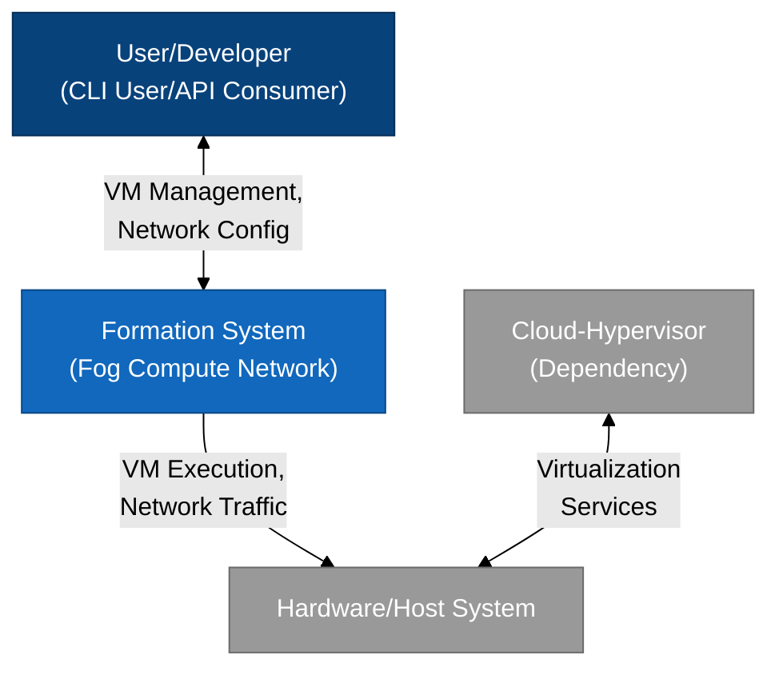
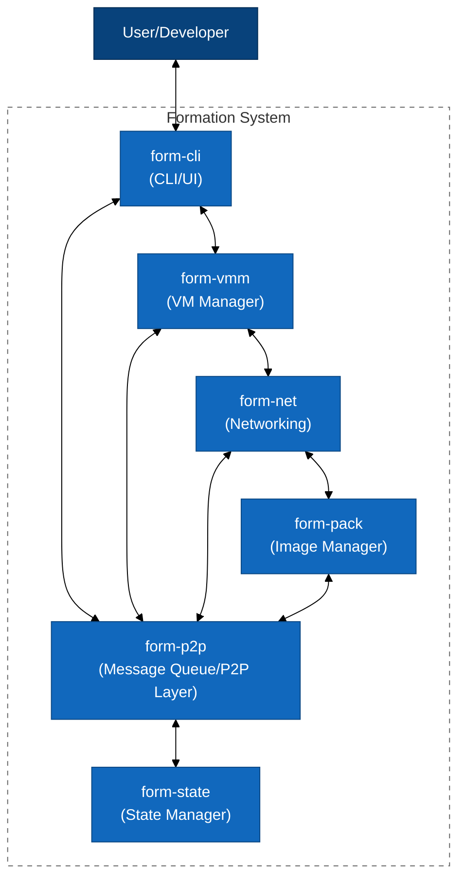

# Formation Architecture

Welcome to the Formation Architecture documentation. This section provides detailed insights into the technical architecture of the Formation platform, including its components, data flows, and design principles.

## Architectural Overview

Formation is built as a distributed, decentralized fog computing network with several key components:

- **VMM (Virtual Machine Manager)**: Manages VM lifecycle and resources
- **Networking Layer**: Handles secure communication between nodes and instances
- **Pack Manager**: Manages VM images and builds
- **P2P Layer**: Enables peer-to-peer communication and message queuing
- **State Manager**: Maintains distributed state across the network

## Architecture Diagrams

### System Context (L1)

The Level 1 diagram shows Formation in relation to its users and external systems:

### Container Diagram (L2)

The Level 2 diagram shows the major containers (components) of the Formation system:

## Key Design Principles

### Decentralization

Formation is designed to be fully decentralized, with no central points of control or failure:

- P2P networking and communication
- Distributed state management
- Consensus-based decision making
- Self-healing network topology

### Security and Privacy

Security is built into every layer of the stack:

- End-to-end encryption for all communications
- Confidential computing for workload privacy
- Cryptographic verification of all operations
- Zero-trust security model

### Scalability

The system is designed to scale horizontally across thousands of nodes:

- Stateless components where possible
- Eventual consistency with CRDT-based state
- Partition-tolerant design
- Efficient resource utilization

## Implementation Details

### Virtualization

Formation uses Cloud Hypervisor for VM management, providing:

- KVM-based hardware virtualization
- Fast boot times
- Minimal attack surface
- Resource efficiency

### Networking

The networking layer is built on WireGuard, offering:

- Modern cryptography
- High performance
- Simple configuration
- NAT traversal capabilities

### State Management

The distributed state is managed using a BFT-CRDT (Byzantine Fault Tolerant Conflict-free Replicated Data Type) approach:

- Strong eventual consistency
- Partition tolerance
- Byzantine fault tolerance
- Low coordination overhead

## Future Architecture

The Formation architecture roadmap includes:

- Enhanced AI inference capabilities
- Improved geographic distribution algorithms
- Advanced workload scheduling
- Extended hardware support
- Federation capabilities

For detailed information on specific components, see the individual architecture documents in this section.

For implementation details, refer to the [API Reference](/api/) section. 