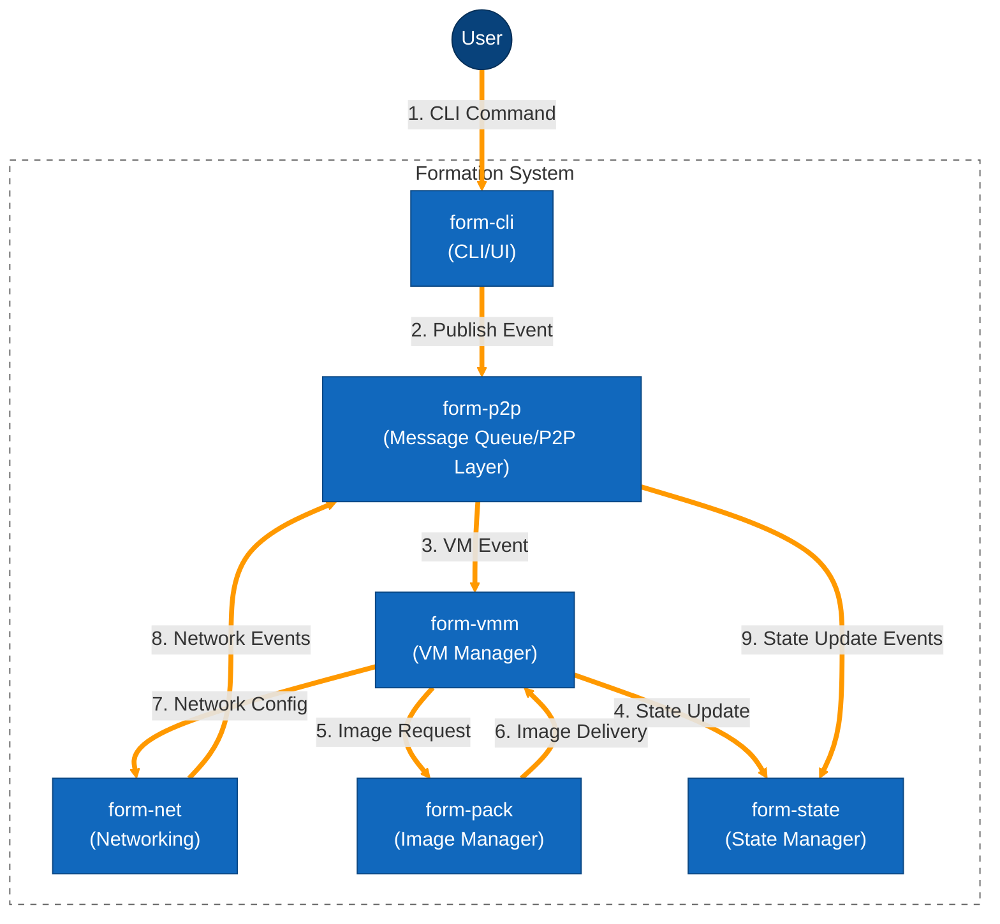

# Formation System - Animated Data Flow Diagram

This diagram illustrates the event flow through the Formation system with highlighted paths to simulate animation.

## Description

This diagram shows the flow of data through the Formation system with highlighted pathways to simulate animation:

1. The user initiates the process by submitting a CLI command
2. The command is published as an event to the P2P messaging layer
3. The P2P layer routes the event to the VMM (Virtual Machine Manager)
4. The VMM updates the state in the form-state component
5. The VMM requests a VM image from the form-pack component
6. The form-pack component delivers the VM image back to the VMM
7. The VMM configures networking through the form-net component
8. The form-net component sends network events to the P2P layer
9. The P2P layer forwards events to update the system state

The highlighted orange paths (using thicker lines and a distinct color) create a visual representation of the data flow, showing how events and commands propagate through the system. 