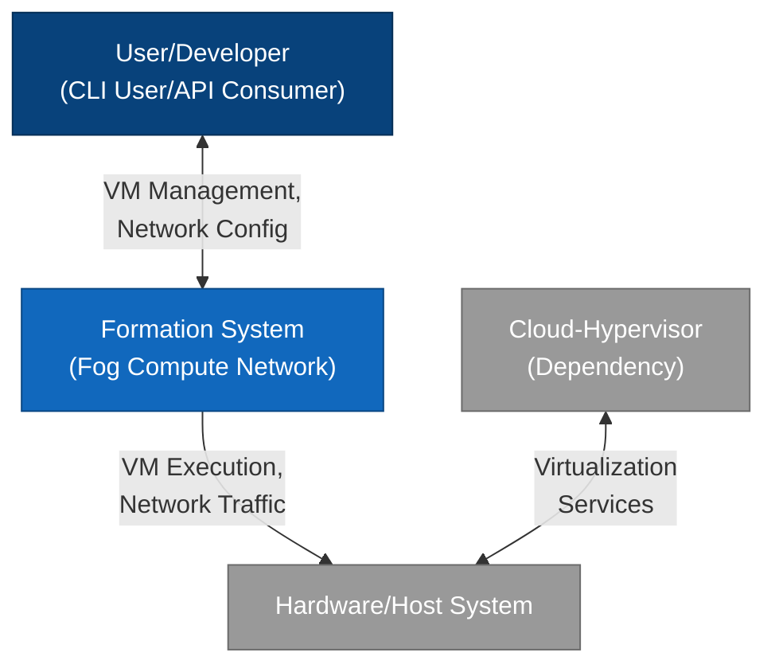

# Formation System - C4 Context Diagram (Level 1)

This diagram shows the Formation system in context, including its relationships with users and external systems.

## Description

This context diagram illustrates:

- **User/Developer**: Interacts with the Formation system through CLI commands and API calls
- **Formation System**: The core fog compute network that manages virtual machines and networking
- **Hardware/Host System**: The underlying physical infrastructure that hosts Formation
- **Cloud-Hypervisor**: The dependency that Formation uses for VM management

All communication between components is shown with annotated arrows that describe the nature of the interaction. 