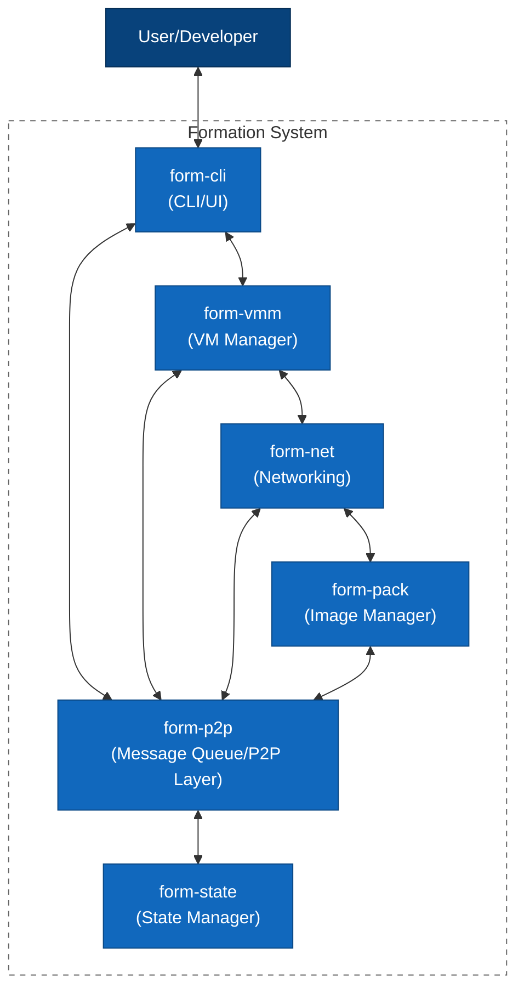

# Formation System - C4 Container Diagram (Level 2)

This diagram shows the major containers (components) of the Formation system and their relationships.

## Description

This container diagram illustrates the main components of the Formation system:

- **form-cli**: The command-line interface and user interaction layer
- **form-vmm**: Virtual machine manager based on Cloud Hypervisor
- **form-net**: Network management based on WireGuard
- **form-pack**: VM image management and packaging
- **form-p2p**: Peer-to-peer messaging system that acts as a message queue
- **form-state**: Distributed state management with BFT-CRDT

The arrows show the communication paths between components, primarily flowing through the form-p2p layer which serves as the central messaging bus for the system. Components can also communicate directly via API calls when immediate responses are needed. 