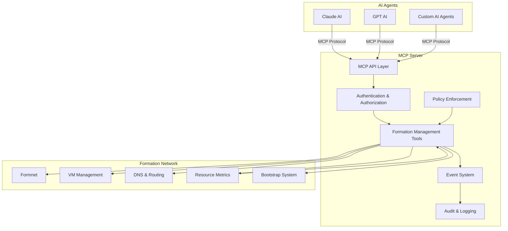
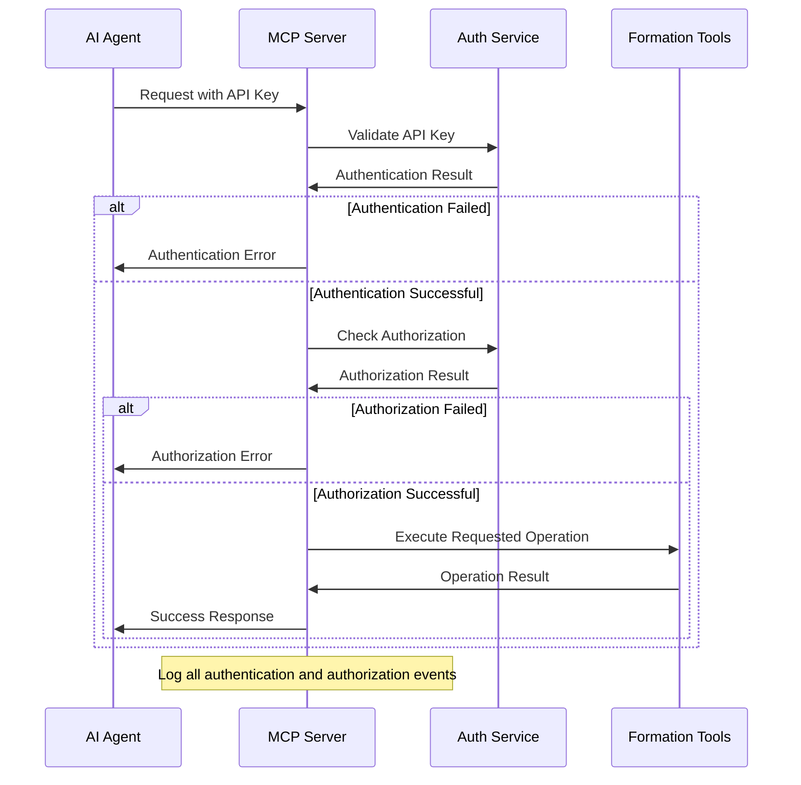
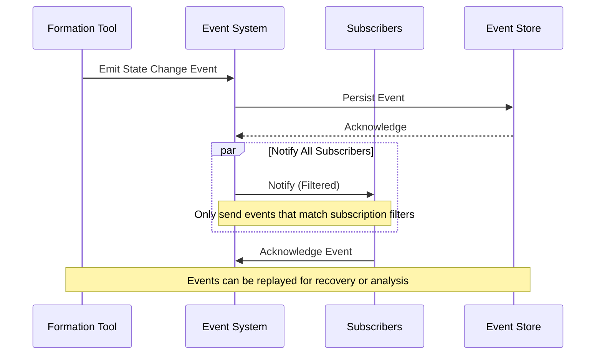
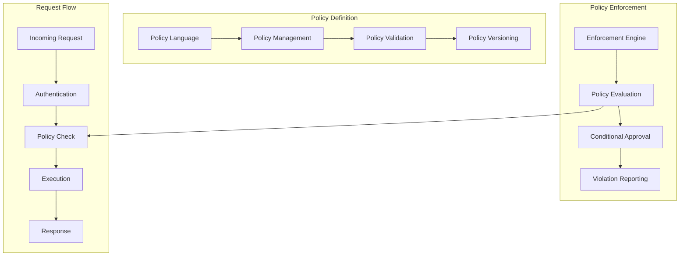
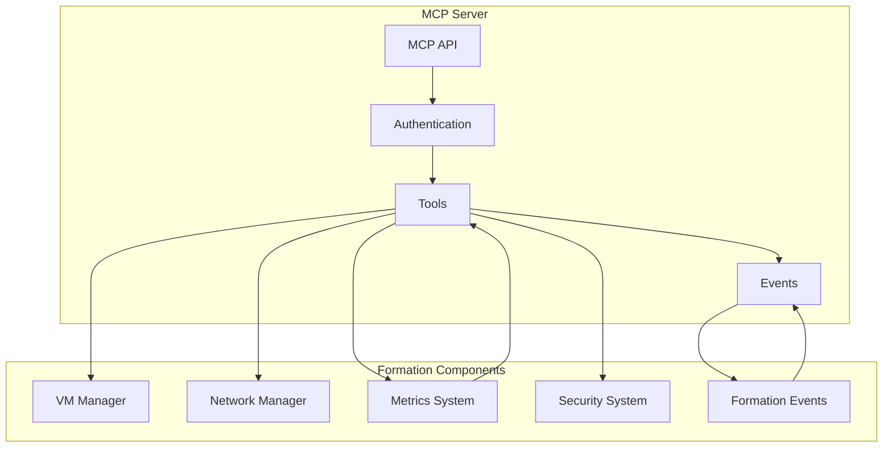

# MCP Server Implementation Plan for Formation Network

## Overall Status: Phase 1 (90% Complete)

Current status:
- Core infrastructure is implemented and functional
- VM management tools are fully implemented (status, control, create, list, delete)
- Operations repository for long-running tasks is complete
- API endpoint structure is in place
- Automated cleanup for expired operations is working
- Authentication and authorization system is implemented with JWT tokens

Remaining high-priority tasks:
- Testing with Claude Desktop
- Basic security testing

## Table of Contents

## 1. Introduction and Overview

### 1.1 Purpose

This document outlines a comprehensive plan for implementing a Model Context Protocol (MCP) server for the Formation network. The MCP server will serve as a management control plane that enables AI agents and operators to manage workload lifecycles securely and efficiently. By following the MCP specification, our implementation will be compatible with various AI clients while providing powerful management capabilities specific to the Formation network.

### 1.2 Current Architecture

The Formation network currently provides capabilities for:

1. **Peer-to-peer networking** via formnet
2. **VM provisioning and management** 
3. **Resource usage monitoring**
4. **DNS-based routing** with health awareness
5. **Bootstrap node discovery**

However, these capabilities currently lack a standardized interface for AI agents to interact with the system programmatically.

### 1.3 Proposed Architecture with MCP

The proposed architecture adds an MCP server that:

1. **Provides standardized interfaces** for AI agents to manage workloads
2. **Secures access** to Formation network management functions
3. **Enables automation** of common management tasks
4. **Exposes metrics and telemetry** for intelligent decision-making
5. **Maintains audit records** of all management actions

## 2. Technical Background

### 2.1 Model Context Protocol (MCP)

The Model Context Protocol (MCP) is a standardized protocol for AI models to interact with external tools and data sources. Key features include:

- **Standardized API format** for tools to expose their capabilities
- **Resource mentions** allowing AI to reference specific resources
- **Structured input/output** for reliable tool interactions
- **Authentication mechanisms** for secure access control
- **Discoverability** of available tools and their capabilities

### 2.2 Formation Network Management

The Formation network requires various management operations:

- **VM lifecycle management**: Creation, monitoring, scaling, and termination
- **Network configuration**: Routing, DNS, and connectivity management
- **Resource allocation**: CPU, memory, storage, and network bandwidth
- **Health monitoring**: Service health, performance metrics, and alerts
- **Security operations**: Access control, audit, and policy enforcement

### 2.3 Integration Points

The MCP server will integrate with the Formation network at several key points:

1. **VM Management API**: For lifecycle operations on virtual machines
2. **Formnet Configuration**: For network management and peer discovery
3. **Metrics Collection**: For health monitoring and resource optimization
4. **DNS & Routing**: For network address management
5. **Authentication System**: For secure access to management functions

## 3. Detailed Implementation Plan

### 3.1 Core MCP Server Infrastructure

#### 3.1.1 Server Framework

- **Task**: Implement the core MCP server framework
- **Subtasks**:
  - [x] Select appropriate language and framework (Rust with Actix or TypeScript/JavaScript)
  - [x] Set up project structure and build system
  - [x] Implement the MCP protocol specification
  - [x] Create API endpoint handlers
  - [x] Develop request/response validation
  - [x] Implement error handling and logging

#### 3.1.2 Authentication and Authorization

- **Task**: Implement authentication and authorization for MCP
- **Subtasks**:
  - [x] Design authentication flow for AI agents
  - [x] Implement API key validation
  - [x] Create role-based access control system
  - [x] Develop policy enforcement for operations
  - [x] Implement request signing and validation
  - [x] Create audit logging of authentication events

#### 3.1.3 Tool Registration and Discovery

- **Task**: Implement tool registration and discovery system
- **Subtasks**:
  - [x] Design tool registration API
  - [x] Create tool metadata schema
  - [x] Implement dynamic tool loading
  - [x] Develop tool capability discovery
  - [x] Create tool version management
  - [x] Implement tool dependency resolution

### 3.2 Formation Management Tools

#### 3.2.1 VM Lifecycle Management

- **Task**: Implement VM lifecycle management tools
- **Subtasks**:
  - [x] Create VM provisioning tool
    - [x] Implement VM template selection
    - [x] Develop configuration parameter handling
    - [x] Create validation of resource requests
  - [x] Build VM control tools
    - [x] Implement start/stop/restart operations
    - [x] Create snapshot management
    - [x] Develop backup and restore functionality
  - [x] Implement VM monitoring tool
    - [x] Create health status checking
    - [x] Implement resource usage monitoring
    - [x] Develop performance metrics collection
  - [x] Build VM termination tool
    - [x] Implement graceful shutdown
    - [x] Create resource cleanup
    - [x] Develop audit record creation

```mermaid
graph TD
    subgraph "VM Lifecycle Management"
        Provision["VM Provisioning Tool"]
        Control["VM Control Tool"]
        Monitor["VM Monitoring Tool"]
        Terminate["VM Termination Tool"]
    end
    
    subgraph "VM Provisioning"
        Templates["Template Selection"]
        Config["Configuration Management"]
        Validation["Resource Validation"]
        Creation["VM Creation"]
    end
    
    subgraph "VM Control"
        PowerOps["Power Operations"]
        Snapshots["Snapshot Management"]
        Backup["Backup/Restore"]
    end
    
    subgraph "VM Monitoring"
        Health["Health Status"]
        Usage["Resource Usage"]
        Perf["Performance Metrics"]
    end
    
    subgraph "VM Termination"
        Shutdown["Graceful Shutdown"]
        Cleanup["Resource Cleanup"]
        AuditLog["Audit Logging"]
    end
    
    Provision --> Templates
    Provision --> Config
    Provision --> Validation
    Provision --> Creation
    
    Control --> PowerOps
    Control --> Snapshots
    Control --> Backup
    
    Monitor --> Health
    Monitor --> Usage
    Monitor --> Perf
    
    Terminate --> Shutdown
    Terminate --> Cleanup
    Terminate --> AuditLog
```

#### 3.2.2 Network Management

- **Task**: Implement network management tools
- **Subtasks**:
  - [ ] Create peer discovery and connection tool
    - [ ] Implement bootstrap node discovery
    - [ ] Develop peer connection operations
    - [ ] Create peer status monitoring
  - [ ] Build network routing tool
    - [ ] Implement route management
    - [ ] Create traffic optimization
    - [ ] Develop failover configuration
  - [ ] Implement DNS management tool
    - [ ] Create DNS record management
    - [ ] Implement health-based routing configuration
    - [ ] Develop DNS monitoring and metrics

#### 3.2.3 Resource Optimization

- **Task**: Implement resource optimization tools
- **Subtasks**:
  - [ ] Create resource allocation recommendation tool
    - [ ] Implement usage pattern analysis
    - [ ] Develop optimization algorithm
    - [ ] Create recommendation generation
  - [ ] Build performance monitoring tool
    - [ ] Implement metric collection
    - [ ] Create anomaly detection
    - [ ] Develop trend analysis
  - [ ] Implement cost optimization tool
    - [ ] Create resource usage pricing
    - [ ] Implement cost projection
    - [ ] Develop efficiency recommendations

### 3.3 Event and Monitoring System

#### 3.3.1 Event System

- **Task**: Implement event system for workload state changes
- **Subtasks**:
  - [ ] Design event schema and types
  - [ ] Create event publication mechanism
  - [ ] Implement event subscription API
  - [ ] Develop event filtering
  - [ ] Create event persistence
  - [ ] Implement event replay for recovery

#### 3.3.2 Monitoring Integration

- **Task**: Integrate with Formation monitoring systems
- **Subtasks**:
  - [ ] Design monitoring data flow
  - [ ] Implement metric collection integration
  - [ ] Create health status aggregation
  - [ ] Develop alert system integration
  - [ ] Implement dashboard data providers
  - [ ] Create historical data access

#### 3.3.3 Audit System

- **Task**: Implement comprehensive audit system
- **Subtasks**:
  - [ ] Design audit record schema
  - [ ] Create audit logging for all operations
  - [ ] Implement audit record storage
  - [ ] Develop audit search and filtering
  - [ ] Create audit record export
  - [ ] Implement compliance reporting

### 3.4 Policy and Safety Framework

#### 3.4.1 Policy Definition

- **Task**: Implement policy definition system
- **Subtasks**:
  - [ ] Design policy language and schema
  - [ ] Create policy management API
  - [ ] Implement policy validation
  - [ ] Develop policy versioning
  - [ ] Create policy import/export
  - [ ] Implement policy templates

#### 3.4.2 Policy Enforcement

- **Task**: Implement policy enforcement engine
- **Subtasks**:
  - [ ] Design enforcement architecture
  - [ ] Create request validation against policies
  - [ ] Implement policy evaluation engine
  - [ ] Develop conditional approval flows
  - [ ] Create policy violation reporting
  - [ ] Implement enforcement bypass for emergencies

#### 3.4.3 Safety Mechanisms

- **Task**: Implement safety mechanisms
- **Subtasks**:
  - [ ] Design operation limits and thresholds
  - [ ] Create resource quotas
  - [ ] Implement rate limiting
  - [ ] Develop conflict detection
  - [ ] Create rollback mechanisms
  - [ ] Implement emergency shutdown

### 3.5 API and Integration

#### 3.5.1 MCP API Implementation

- **Task**: Implement MCP API according to protocol specification
- **Subtasks**:
  - [ ] Design API structure and endpoints
  - [ ] Create request/response handlers
  - [ ] Implement protocol version support
  - [ ] Develop error handling
  - [ ] Create rate limiting
  - [ ] Implement request validation

#### 3.5.2 Formation Integration

- **Task**: Integrate with Formation network components
- **Subtasks**:
  - [ ] Design component integration architecture
  - [ ] Create VM management integration
  - [ ] Implement network configuration integration
  - [ ] Develop metrics collection integration
  - [ ] Create security system integration
  - [ ] Implement event system integration

#### 3.5.3 Client Integration

- **Task**: Ensure compatibility with MCP clients
- **Subtasks**:
  - [ ] Identify target MCP clients
  - [ ] Create client-specific documentation
  - [ ] Implement client compatibility testing
  - [ ] Develop client examples
  - [ ] Create client integration guides
  - [ ] Implement client-specific optimizations

## 4. Implementation Phases

The implementation will proceed in logical phases:

### 4.1 Phase 1: Core Infrastructure (MVP)

This phase establishes the foundational MCP server with basic VM management capabilities.

#### 4.1.1 Server Setup
- [x] Choose appropriate language and framework (Rust with Actix Web)
- [x] Set up project structure and basic module layout
- [x] Add missing dependencies to Cargo.toml
- [x] Implement tool registry (core data structures)
- [x] Create placeholder modules for key components
- [x] Implement VM tool registration mechanism
  - [x] Create VM status tool - Retrieves detailed status for VMs with ownership validation
  - [x] Implement VM control operations tool - Start/stop/restart with state checking
  - [x] Implement VM list tool - Lists available VMs with filtering options
  - [x] Create VM provisioning tool - Configurable VM creation with resource options
  - [x] Implement VM delete tool - Safe termination with ownership checks
  - [x] Implement tool parameter validation - For all VM tools
- [x] Create tool execution pipeline
  - [x] Implement error handling for tool execution
  - [x] Implement authentication middleware for tool calls
  - [x] Create logging for tool execution
- [x] Implement basic MCP protocol data models
  - [x] Create tool request/response structures
  - [x] Implement resource reference handling
  - [x] Create schema for tool metadata
- [x] Create operations repository for long-running tasks
  - [x] Implement operation tracking system
  - [x] Create API for operation status checks
  - [x] Build automated cleanup for expired operations
- [x] Create authentication integration with existing credentials
  - [x] Implement keypair management for signature verification
  - [x] Create JWT token-based authentication
  - [x] Add authentication middleware for API endpoints
  - [x] Implement basic authorization checks
- [x] Develop API endpoint structure

#### 4.1.2 Initial Tools
- [x] VM status and information tool
- [x] VM control operations (start/stop/restart)
- [x] Basic VM provisioning
- [x] Simple VM termination
- [x] VM listing with filtering

#### 4.1.3 Testing
- [ ] Test with Claude Desktop
- [ ] Basic security testing
- [ ] Performance testing
- [ ] Compatibility testing

### 4.2 Phase 2: Advanced Features

This phase adds more sophisticated management capabilities.

#### 4.2.1 Enhanced Security
- [ ] Role-based access control
- [ ] Policy enforcement
- [ ] Comprehensive audit logging

#### 4.2.2 Advanced Tools
- [ ] Network configuration management
- [ ] Resource optimization recommendations
- [ ] Advanced VM lifecycle management
- [ ] Performance monitoring and analysis

#### 4.2.3 Event System
- [ ] Implement event publication
- [ ] Create subscription mechanism
- [ ] Develop event persistence

### 4.3 Phase 3: Integration and Optimization

This phase connects the MCP server with the broader Formation ecosystem.

#### 4.3.1 Deep Integration
- [ ] Formation metrics integration
- [ ] Integration with elastic scaling (future)
- [ ] DNS and routing management integration

#### 4.3.2 Client Optimizations
- [ ] Optimize for specific AI clients
- [ ] Create client-specific documentation
- [ ] Develop client examples

#### 4.3.3 Performance Optimization
- [ ] Performance profiling
- [ ] Scalability improvements
- [ ] Caching and efficiency optimizations

## 5. MVP Definition

The Minimum Viable Product (MVP) for the MCP server will include:

### 5.1 Core Capabilities

1. **Basic MCP Protocol Implementation**
   - Implement core protocol specification
   - Support resource mentions
   - Basic tool definitions

2. **Essential Authentication**
   - API key authentication
   - Basic authorization checks
   - Simple audit logging

3. **VM Management Tools** ✓ (Completed)
   - **VM Create Tool** ✓: Comprehensive VM provisioning with configurable CPU, memory, disk, network options and automated image selection
   - **VM Status Tool** ✓: Detailed VM status reporting including resource allocation, network configuration, and runtime statistics
   - **VM Control Tool** ✓: Lifecycle operations (start/stop/restart) with state validation and permission checks
   - **VM List Tool** ✓: Listing VMs with filtering capabilities and detailed resource information
   - **VM Delete Tool** ✓: Safe VM termination with ownership verification and force delete options

4. **Simple Monitoring**
   - Basic health status reporting
   - Resource usage reporting
   - Simple alerting

### 5.2 MVP Exclusions

The following will be excluded from the MVP:

1. **Advanced Policy Management**: Will be implemented in phase 2
2. **Sophisticated Event System**: Basic events only in MVP
3. **Complex Optimization Tools**: Will be added in phase 2
4. **Deep Integration**: Minimal integration with other Formation components
5. **Client-Specific Optimizations**: Generic client support only

## 6. Testing Strategy

### 6.1 Unit Testing

1. **API Component Tests**
   - Test API endpoint handlers
   - Test request/response validation
   - Test error handling

2. **Tool Implementation Tests**
   - Test each management tool independently
   - Test tool parameter validation
   - Test tool result handling

### 6.2 Integration Testing

1. **Formation Component Integration**
   - Test VM management integration
   - Test network configuration integration
   - Test metrics integration

2. **Client Integration Tests**
   - Test with Claude Desktop
   - Test with other MCP-compatible clients
   - Test with custom internal tools

### 6.3 Security Testing

1. **Authentication Testing**
   - Test API key validation
   - Test role-based access control
   - Test policy enforcement

2. **Authorization Testing**
   - Test permission boundaries
   - Test resource access controls
   - Test audit logging

### 6.4 Performance Testing

1. **Load Testing**
   - Test concurrent request handling
   - Test response times under load
   - Test resource utilization

2. **Scalability Testing**
   - Test with increasing numbers of VMs
   - Test with increasing numbers of clients
   - Test with complex operation sequences

## 7. Future Enhancements

### 7.1 Advanced Features

1. **Intelligent Workload Scheduling**
   - ML-based resource optimization
   - Predictive scaling
   - Workload placement optimization

2. **Enhanced Security**
   - Federated authentication
   - Advanced threat detection
   - Fine-grained permission model

3. **Comprehensive Monitoring**
   - Advanced analytics dashboard
   - Historical trend analysis
   - Predictive failure detection

### 7.2 Integration Opportunities

1. **Elastic Scaling Integration**
   - Expose scaling capabilities via MCP
   - Automated scaling recommendations
   - Stateful scaling operations

2. **AI Inference Engine Integration**
   - Manage AI model deployment
   - Configure inference clusters
   - Monitor inference performance

3. **Cross-Platform Integration**
   - Cloud provider integration
   - Multi-environment management
   - Hybrid deployment support

### 7.3 Ecosystem Development

1. **Custom MCP Client Development**
   - Formation-specific MCP clients
   - CLI tools using MCP
   - Web UI for MCP operations

2. **Tool Marketplace**
   - Plugin architecture for community tools
   - Tool versioning and distribution
   - Tool metadata and documentation

3. **Developer SDK**
   - Simplified tool creation
   - Testing framework for MCP tools
   - Example tools and templates

## 8. Implementation Considerations

### 8.1 Technology Selection

For optimal integration with the Formation ecosystem, the MCP server could be implemented using:

1. **Primary Options**:
   - **Rust** with Actix Web (consistent with existing Formation components)
   - **TypeScript/JavaScript** (matching reference MCP implementations)

2. **Database Options**:
   - **PostgreSQL** for structured data and audit logs
   - **Redis** for caching and ephemeral data

3. **Integration Technologies**:
   - **gRPC** for high-performance internal communication
   - **REST** for external API access
   - **WebSockets** for event streaming

### 8.2 Security Considerations

1. **Authentication**: 
   - Use industry-standard authentication methods
   - Support API keys and potentially OAuth/OIDC
   - Implement credential rotation

2. **Authorization**:
   - Implement role-based access control
   - Support fine-grained permissions
   - Create audit logs for all access

3. **Data Protection**:
   - Encrypt sensitive data at rest
   - Use TLS for all communications
   - Implement data minimization principles

### 8.3 Performance Considerations

1. **Scalability**:
   - Design for horizontal scaling
   - Implement efficient resource utilization
   - Consider stateless architecture where possible

2. **Responsiveness**:
   - Optimize for low latency responses
   - Implement caching where appropriate
   - Consider asynchronous operations for long-running tasks

3. **Reliability**:
   - Implement circuit breakers for external dependencies
   - Create retry mechanisms with backoff
   - Design for graceful degradation

## 9. Timeline and Resources

### 9.1 Estimated Timeline

**Phase 1 (MVP)**: ~90% Complete
- ✅ Core server implementation: Complete
- ✅ Basic tool implementation: Complete
- ✅ Authentication & Authorization: Complete
- ⏳ Testing and refinement: In Progress

**Next Steps**:
- Conduct testing with Claude Desktop
- Add basic security and performance testing
- Documentation and API reference

**Phase 2**: 6-8 weeks (Not Started)
- Week 1-3: Enhanced security implementation
- Week 4-6: Advanced tool development
- Week 7-8: Event system implementation

**Phase 3**: 6-8 weeks (Not Started)
- Week 1-3: Integration with Formation components
- Week 4-6: Client optimizations
- Week 7-8: Performance optimization

### 9.2 Required Resources

**Development Team**:
- 2-3 Backend developers
- 1 Security specialist
- 1 QA engineer

**Infrastructure**:
- Development environment
- Testing environment
- CI/CD pipeline

**External Dependencies**:
- MCP specification compliance testing
- Client compatibility testing

## 10. Conclusion

The implementation of an MCP server for the Formation network will provide a standard interface for AI agents to manage workload lifecycles. By following the MCP specification, we ensure compatibility with existing AI clients while providing powerful management capabilities specific to the Formation network.

The phased approach ensures that we can deliver value incrementally, starting with the core VM management capabilities and expanding to more sophisticated features over time. The MVP definition provides a clear target for initial development, while the future enhancements outline a path for ongoing evolution.

By integrating with existing Formation components and leveraging established technologies, we can efficiently implement a robust MCP server that enhances the platform's capabilities and positions it for future growth. 