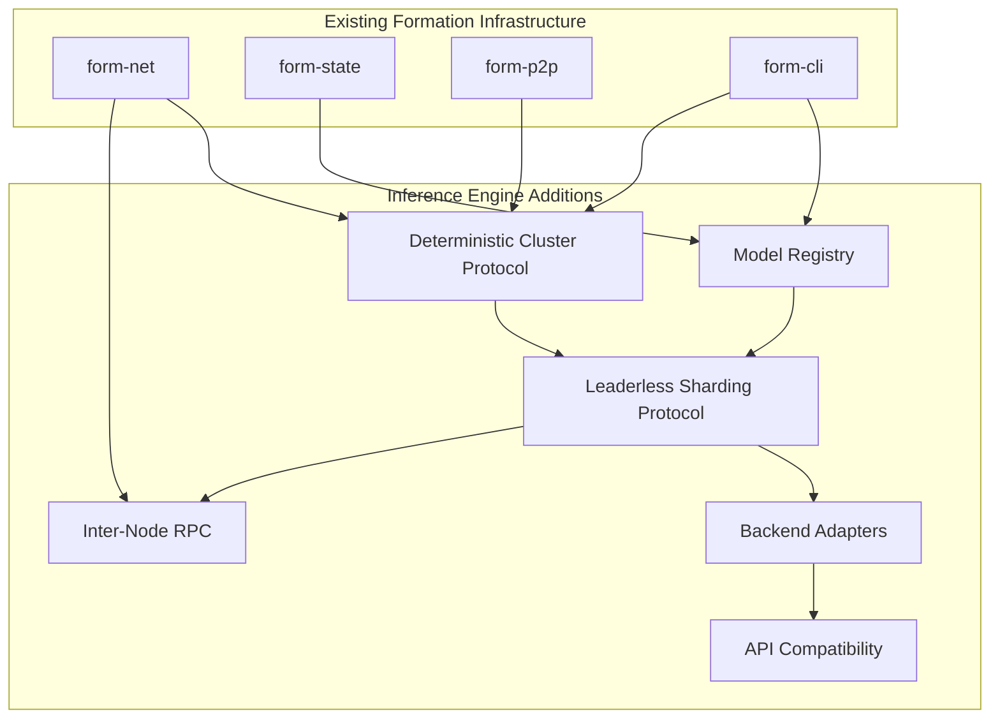
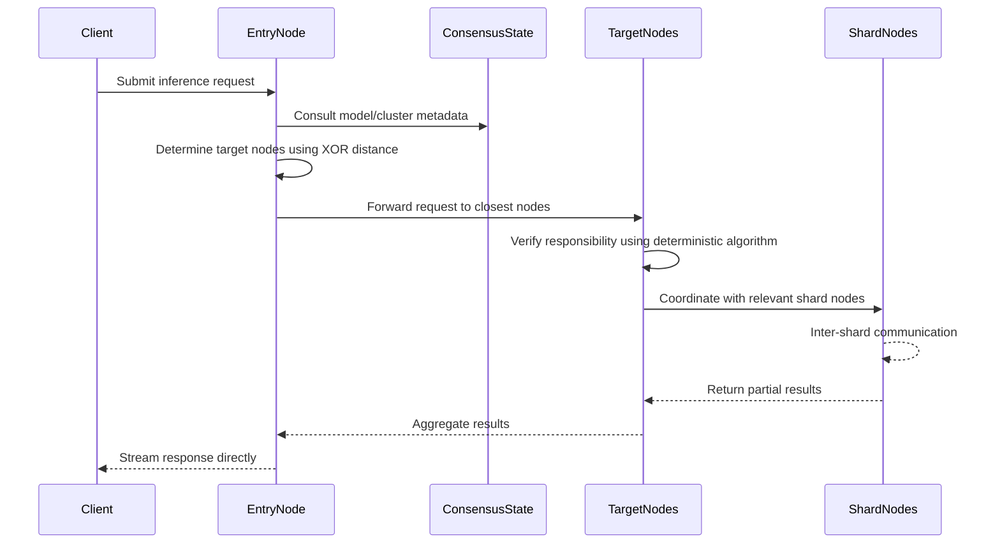
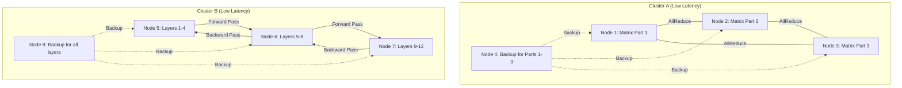
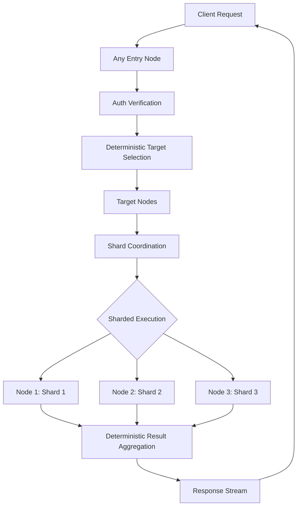
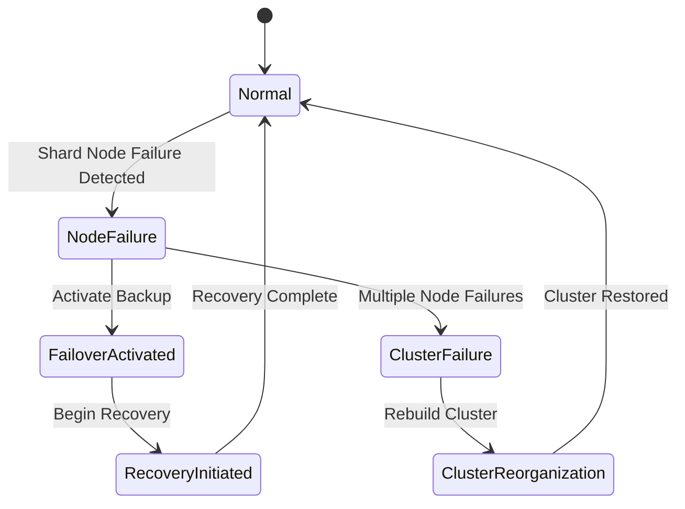
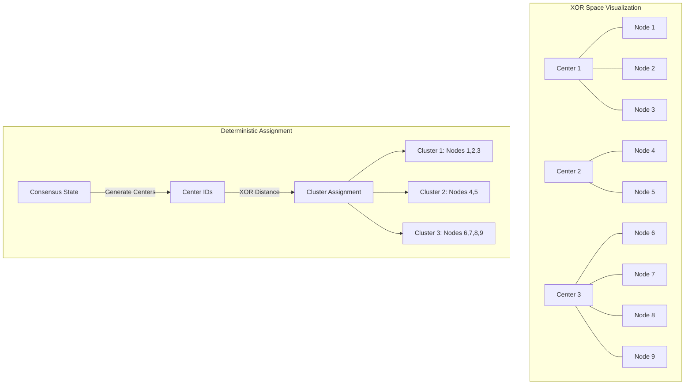
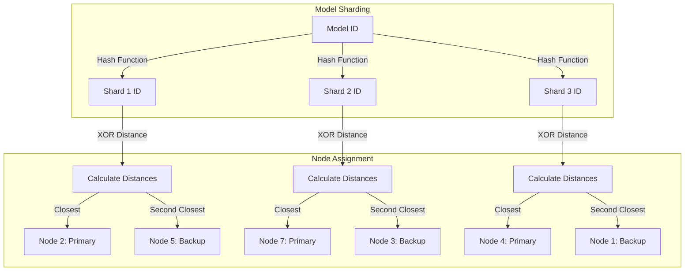

# Decentralized Peer-to-Peer Inference Engine: Implementation Plan

## Table of Contents
- [Executive Summary](#executive-summary)
- [System Requirements](#system-requirements)
- [Architecture Overview](#architecture-overview)
- [Phase 1: Integration with Formation Infrastructure](#phase-1-integration-with-formation-infrastructure)
- [Phase 2: Model Management](#phase-2-model-management)
- [Phase 3: Inference Engine](#phase-3-inference-engine)
- [Phase 4: API Compatibility Layer](#phase-4-api-compatibility-layer)
- [Phase 5: Reliability and Scaling](#phase-5-reliability-and-scaling)
- [Technical Deep Dives](#technical-deep-dives)
  - [Network and State Integration](#network-and-state-integration)
  - [Model Sharding Strategies](#model-sharding-strategies)
  - [Inference Request Flow](#inference-request-flow)
  - [Fault Tolerance Mechanisms](#fault-tolerance-mechanisms)
  - [Deterministic Cluster Formation](#deterministic-cluster-formation)
  - [Leaderless Shard Distribution](#leaderless-shard-distribution)
- [Potential Challenges and Mitigations](#potential-challenges-and-mitigations)

## Executive Summary

This document outlines a comprehensive implementation plan for building a decentralized peer-to-peer inference engine for AI models, fully integrated with the existing Formation architecture. The system will leverage Formation's networking and state management while adding new components for model management, cluster-based sharding, and inference on bare metal. The architecture emphasizes leaderless coordination, deterministic algorithms, resilience, scalability, and ease of use, while maintaining compatibility with industry-standard AI APIs.

## System Requirements

1. **Integration with Formation Infrastructure**
   - Utilize existing `form-net` and `form-p2p` for networking
   - Leverage `form-state` CRDT-based distributed state for model metadata only
   - Run inference directly on node bare metal for optimal performance
   - Use existing authentication and authorization mechanisms

2. **Heterogeneous Hardware Support**
   - Track GPU and accelerator resources in node metadata
   - Intelligent workload distribution based on node capabilities
   - Performance profiling to optimize task allocation
   - Direct hardware access for maximum inference performance

3. **Universal Model Compatibility**
   - Support for llama.cpp compatible models (GGUF)
   - Support for non-llama.cpp models (PyTorch, TensorFlow, ONNX)
   - Framework-agnostic tensor operations

4. **Advanced Model Management**
   - Pre-loaded popular models for instant access
   - Model registry integrated with existing `form-state` datastore
   - Distributed model storage

5. **Resilient Operations**
   - Deterministic, leaderless cluster formation and shard distribution
   - Automated redundancy with consensus-based role determination
   - Graceful degradation under partial system failure

6. **Compatible APIs**
   - OpenAI API compatibility
   - Anthropic API compatibility
   - Integration with Formation's authentication system

## Architecture Overview



The system will integrate with existing Formation components:

1. **Network Layer**: Utilize `form-net` and `form-p2p` for peer discovery and connectivity
2. **State Management**: Use `form-state` for model metadata and cluster information only
3. **Leaderless Cluster Protocol**: New component implementing deterministic cluster formation
4. **Inference Engine**: New components running directly on bare metal for maximum performance
5. **API Layer**: New compatibility layers for OpenAI and Anthropic APIs with direct response handling

## Phase 1: Integration with Formation Infrastructure

### 1.1 Extend Form-State with Model Registry Data Structures

#### Implementation Steps:
1. Create new CRDT types for model-related data only
   - Implement `CrdtModel` for model metadata
   - Create `CrdtModelLocation` for tracking model shard locations
   - Implement `CrdtCluster` for inference cluster management
   - Add corresponding operations to `DataStore`

2. Design model registry data structures
   ```rust
   pub struct FormModel {
       pub model_id: String,
       pub name: String,
       pub version: String,
       pub framework: ModelFramework,
       pub format: ModelFormat,
       pub size: u64,
       pub parameters: u64,
       pub owner: String,
       pub sharding_strategy: Option<ShardingStrategy>,
       pub cluster_id: Option<String>,
       pub permissions: HashMap<String, ModelPermission>,
   }
   
   pub enum ModelFramework {
       LlamaCpp,
       PyTorch,
       TensorFlow,
       ONNX,
       Custom(String),
   }
   ```

3. Implement cluster tracking structures
   ```rust
   pub struct InferenceCluster {
       pub cluster_id: String,
       pub nodes: Vec<NodeInfo>,
       pub models: Vec<String>,
       pub total_capacity: HardwareCapacity,
       pub network_latency_matrix: HashMap<(String, String), u32>, // node_id pairs to latency
   }
   
   pub struct NodeInfo {
       pub node_id: String,
       pub hardware_type: HardwareType,
       pub vram: Option<u64>,
       pub supported_frameworks: Vec<ModelFramework>,
       pub hosted_shards: Vec<ShardInfo>,
       pub backup_for: Vec<ShardInfo>,
   }
   ```

### 1.2 Create Node Hardware Detection and Advertising

#### Implementation Steps:
1. Implement hardware detection service
   ```rust
   pub struct HardwareCapabilities {
       pub cpu_info: CpuInfo,
       pub gpu_info: Vec<GpuInfo>,
       pub memory_info: MemoryInfo,
   }
   
   pub struct GpuInfo {
       pub device_id: String,
       pub device_name: String,
       pub vram_bytes: u64,
       pub compute_capability: String,
       pub supported_frameworks: Vec<String>,
   }
   ```

2. Add hardware capabilities to node advertising
   - Extend node information packet with hardware details
   - Create benchmark suite for performance measurement
   - Implement periodic capability updates

3. Develop inference-specific node tags
   - Add machine learning hardware identifiers
   - Create capacity advertisement
   - Update peer discovery for inference capabilities

### 1.3 Implement Inter-Node RPC for Inference

#### Implementation Steps:
1. Create efficient RPC mechanism for inference
   ```rust
   pub trait InferenceRpc {
       async fn shard_forward(&self, request: ShardRequest) -> Result<ShardResponse>;
       async fn shard_backward(&self, gradients: ShardGradients) -> Result<()>;
       async fn synchronize_weights(&self, layer_id: usize) -> Result<LayerWeights>;
       async fn health_check(&self) -> Result<NodeHealth>;
   }
   ```

2. Optimize for minimal latency
   - Implement binary serialization format
   - Create zero-copy buffer management where possible
   - Add compression for large tensor transfers

3. Add security and authentication
   - Implement secure channels between nodes
   - Add request validation
   - Create access control for inference operations

## Phase 2: Model Management and Clustering

### 2.1 Implement Deterministic Cluster Formation

#### Implementation Steps:
1. Design deterministic cluster formation algorithm
   ```rust
   pub struct DeterministicClusterProtocol {
       // Inputs that all nodes have access to
       network_topology: Arc<NetworkTopology>,
       node_capabilities: HashMap<String, NodeInfo>,
       consensus_timestamp: u64,
       
       // Methods
       fn compute_cluster_topology(&self) -> ClusterTopology;
       fn get_my_cluster_membership(&self, node_id: &str) -> Vec<String>;
       fn is_node_in_my_cluster(&self, node_id: &str) -> bool;
       fn get_xor_distance(&self, id1: &str, id2: &str) -> u64;
   }
   ```

2. Implement network latency measurement for topology
   - Create latency measurement protocol
   - Build latency matrix between nodes
   - Implement periodic updates of latency information

3. Create XOR-based clustering algorithm
   ```rust
   impl DeterministicClusterProtocol {
       fn determine_cluster_for_node(&self, node_id: &str) -> String {
           // Calculate XOR distances to potential cluster centers
           // These centers are derived from consensus data
           let centers = self.derive_cluster_centers_from_consensus();
           
           // Find the closest center by XOR distance
           centers.iter()
               .min_by_key(|center| self.xor_distance(node_id, center))
               .cloned()
               .unwrap_or_default()
       }
       
       fn derive_cluster_centers_from_consensus(&self) -> Vec<String> {
           // Use network topology, capabilities, and timestamp to
           // deterministically derive cluster centers
           // Every node will arrive at the same centers with the same inputs
       }
       
       fn xor_distance(&self, id1: &str, id2: &str) -> u64 {
           // Calculate XOR distance between two hashed IDs
           let hash1 = self.hash_id(id1);
           let hash2 = self.hash_id(id2);
           hash1 ^ hash2
       }
   }
   ```

### 2.2 Create Model Upload and Distribution

#### Implementation Steps:
1. Add model management to `form-cli`
   ```rust
   pub enum InferenceCommand {
       UploadModel(UploadModelCommand),
       RunInference(RunInferenceCommand),
       ListModels(ListModelsCommand),
       ManageClusters(ManageClustersCommand),
   }
   
   pub struct UploadModelCommand {
       #[clap(long, short)]
       pub model_path: PathBuf,
       
       #[clap(long, short)]
       pub name: String,
       
       #[clap(long, short)]
       pub version: Option<String>,
       
       #[clap(long, short)]
       pub cluster: Option<String>,
       
       // Additional fields
   }
   ```

2. Create model storage mechanism
   - Implement direct node storage for model shards
   - Create content-addressable storage for deduplication
   - Implement integrity verification

3. Design model distribution within clusters
   - Create efficient distribution protocol
   - Implement direct node-to-node transfers
   - Add verification of model integrity

### 2.3 Implement Deterministic Shard Distribution

#### Implementation Steps:
1. Design intra-cluster sharding strategies
   ```rust
   pub enum ShardingStrategy {
       LayerParallel {
           num_shards: usize,
           layer_assignment_seed: u64, // For deterministic layer assignment
       },
       TensorParallel {
           num_shards: usize,
           tensor_split_seed: u64, // For deterministic tensor splits
       },
       ExpertParallel {
           experts_per_shard: usize,
           expert_assignment_seed: u64, // For deterministic expert assignment
       },
       Hybrid(Vec<ShardingStrategy>),
       None,
   }
   ```

2. Create deterministic shard allocation algorithm
   ```rust
   pub struct DeterministicShardAllocation {
       model_id: String,
       consensus_timestamp: u64,
       cluster_topology: Arc<ClusterTopology>,
       
       // Methods
       fn compute_shard_allocation(&self) -> HashMap<ShardId, Vec<String>>; // Primary and backup nodes
       fn compute_my_assigned_shards(&self, node_id: &str) -> Vec<ShardId>;
       fn compute_my_backup_shards(&self, node_id: &str) -> Vec<ShardId>;
       fn get_xor_distance(&self, id1: &str, id2: &str) -> u64;
   }
   
   impl DeterministicShardAllocation {
       fn get_node_for_shard(&self, shard_id: &ShardId) -> Vec<String> {
           // Calculate XOR distances between shard ID and nodes in the cluster
           // Return the k closest nodes (for primary and backups)
           // The nodes themselves can determine if they are primary or backup
           // based on their relative position in the result
           let nodes = self.cluster_topology.get_nodes_in_cluster();
           
           nodes.into_iter()
               .sorted_by_key(|node_id| self.xor_distance(shard_id.to_string(), node_id))
               .take(self.redundancy_factor)
               .collect()
       }
   }
   ```

3. Implement redundancy and backup mechanism
   - Create deterministic backup node selection
   - Implement consensus on failover sequence
   - Design failure detection protocol

## Phase 3: Inference Engine

### 3.1 Create Model Backend Adapters for Bare Metal

#### Implementation Steps:
1. Design universal model interface for direct hardware access
   ```rust
   pub trait ModelBackend {
       fn load(&mut self, path: &Path) -> Result<ModelHandle>;
       fn get_metadata(&self) -> ModelMetadata;
       fn run_inference(&self, inputs: Inputs) -> Result<Outputs>;
       fn get_memory_requirements(&self) -> MemoryRequirements;
   }
   ```

2. Implement hardware-specific adapters
   ```rust
   pub struct LlamaCppAdapter {
       model_path: PathBuf,
       context: LlamaContext,
       gpu_layers: Option<usize>,
       // Implementation details
   }
   
   impl ModelBackend for LlamaCppAdapter {
       // Implementation for llama.cpp models with direct GPU access
   }
   ```

3. Create efficient memory management
   - Implement pinned memory for faster GPU transfers
   - Create memory pool for tensor operations
   - Build efficient weight sharing between models

### 3.2 Build Leaderless Inference Coordination

#### Implementation Steps:
1. Implement decentralized request handling
   ```rust
   pub struct InferenceNode {
       cluster_protocol: Arc<DeterministicClusterProtocol>,
       shard_allocation: Arc<DeterministicShardAllocation>,
       active_requests: HashMap<String, InferenceRequest>,
       model_registry: Arc<ModelRegistry>,
       
       // Methods
       async fn handle_request(&mut self, request: InferenceRequest) -> Result<ResponseStream>;
       async fn process_shard_work(&self, shard_id: ShardId, work: ShardWork) -> Result<ShardResult>;
       async fn get_request_status(&self, request_id: &str) -> RequestStatus;
       async fn cancel_request(&mut self, request_id: &str) -> Result<()>;
   }
   ```

2. Create deterministic request routing to appropriate nodes
   - Calculate target nodes based on request and model IDs
   - Route requests using consensus metadata
   - Implement deterministic fallback paths

3. Design direct response streaming
   - Create efficient streaming protocol
   - Implement token-by-token response delivery
   - Build client connection management with deterministic aggregator selection

## Phase 4: API Compatibility Layer

### 4.1 Implement OpenAI-Compatible API

#### Implementation Steps:
1. Create API endpoints integrated with Formation auth
   ```rust
   pub fn inference_api_routes(state: Arc<InferenceCoordinator>) -> Router {
       Router::new()
           .route("/v1/chat/completions", post(chat_completions_handler))
           .route("/v1/embeddings", post(embeddings_handler))
           .route("/v1/models", get(list_models_handler))
           // Additional routes
           .with_state(state)
   }
   ```

2. Implement request translation with direct routing
   - Convert OpenAI request format to internal format
   - Route directly to appropriate cluster
   - Implement streaming response handling

3. Create direct response streaming
   - Stream results directly from inference nodes
   - Implement SSE for streaming responses
   - Add proper error handling and status codes

### 4.2 Implement Anthropic-Compatible API

#### Implementation Steps:
1. Create Anthropic-compatible endpoints with direct response handling
   - Implement Claude-compatible API routes
   - Add message structure compatibility
   - Support tool use capabilities

2. Build secure authentication
   - Integrate with existing wallet-based authentication
   - Implement API key management
   - Create permission checking based on accounts

3. Implement rate limiting with direct accounting
   - Track usage at the API gateway level
   - Implement tiered rate limiting
   - Create quota management system

### 4.3 Add Inference CLI to Form-CLI

#### Implementation Steps:
1. Implement inference CLI commands
   ```rust
   // In form-cli
   pub fn register_inference_commands(app: Command) -> Command {
       app.subcommand(
           Command::new("inference")
               .about("AI inference commands")
               .subcommand(
                   Command::new("model")
                       .about("Model management")
                       .subcommand(upload_model_command())
                       .subcommand(list_models_command())
                       // Additional subcommands
               )
               .subcommand(
                   Command::new("run")
                       .about("Run inference")
                       // Parameters
               )
               .subcommand(
                   Command::new("cluster")
                       .about("Manage inference clusters")
                       // Cluster management subcommands
               )
       )
   }
   ```

2. Create user-friendly output formatting
   - Implement progress indicators for long-running operations
   - Create formatted output for inference results
   - Add error reporting with troubleshooting hints

3. Implement cluster management commands
   - Add commands for viewing cluster status
   - Create tools for manual cluster optimization
   - Implement model assignment commands

## Phase 5: Reliability and Scaling

### 5.1 Implement Intra-Cluster Fault Tolerance

#### Implementation Steps:
1. Create health monitoring system
   - Implement heartbeat mechanism between cluster nodes
   - Create fast failure detection
   - Build health metric collection

2. Build shard redundancy mechanism within clusters
   - Maintain backup copies of all shards within cluster
   - Implement automatic failover to backup node
   - Design minimum disruption recovery strategy

3. Develop partial result handling
   - Create mechanisms to handle partial failures
   - Implement quality degradation options
   - Design fallback to smaller models within same cluster

### 5.2 Add Dynamic Cluster Scaling

#### Implementation Steps:
1. Implement demand-based cluster sizing
   - Monitor inference queue length and latency
   - Create dynamic cluster membership
   - Implement cluster split and merge based on load

2. Build cross-cluster coordination
   - Create mechanisms for clusters to share load
   - Implement model migration between clusters
   - Design geo-distributed cluster formation

3. Optimize cluster performance
   - Create periodic cluster optimization
   - Implement predictive node allocation
   - Build adaptive sharding based on observed performance

### 5.3 Implement Security for Bare Metal Inference

#### Implementation Steps:
1. Create secure model access
   - Implement encrypted model storage
   - Create secure loading mechanisms
   - Design access control for model weights

2. Build input/output security
   - Implement end-to-end encryption for requests
   - Create secure memory handling for inference data
   - Design secure deletion of inference artifacts

3. Develop isolation mechanisms
   - Implement process isolation for multi-tenant nodes
   - Create resource partitioning for shared hardware
   - Build security boundaries between inference workloads

## Technical Deep Dives

### Network and State Integration

The inference engine will integrate with Formation's network layer while keeping inference I/O separate:

1. **Minimal State Usage**:
   - Store only model metadata and cluster information in CRDT store
   - Keep inference inputs/outputs out of the distributed state
   - Use direct RPC for inter-node inference communication

2. **Consensus-Based Topology**:
   - Use network latency as a key input to consensus calculations
   - Create a consistent view of network topology across all nodes
   - Maintain topology information using CRDT properties

3. **Direct Response Handling**:
   - Stream inference results directly to requestor
   - Minimize data passing through intermediaries
   - Implement efficient aggregation based on deterministic node selection



### Model Sharding Strategies

The system will implement cluster-based sharding strategies optimized for minimal network latency:

1. **Intra-Cluster Tensor Parallelism**:
   - Split individual weight matrices across nodes within same cluster
   - Synchronize with minimal latency during matrix operations
   - Optimize for densely connected network within cluster

2. **Intra-Cluster Layer Parallelism**:
   - Assign different model layers to different nodes within same cluster
   - Pipeline inputs between nodes with minimal latency
   - Balance computation and communication within cluster boundary

3. **Redundancy Within Cluster**:
   - Maintain backup copies of shards within same cluster
   - Enable immediate failover with minimal disruption
   - Design recovery coordination with cluster primary



### Inference Request Flow

The system will optimize the inference request flow with deterministic routing:

1. **Deterministic Request Routing**:
   - Calculate target nodes using XOR distance between request ID and node IDs
   - Route directly to responsible nodes using deterministic algorithm
   - Authenticate at entry point with consistent verification

2. **Bare Metal Execution**:
   - Execute inference directly on hardware
   - Access GPUs and accelerators directly
   - Minimize operating system overhead

3. **Direct Response Streaming**:
   - Stream results directly to client
   - Deterministically select aggregation nodes
   - Avoid unnecessary data storage



### Fault Tolerance Mechanisms

The system implements cluster-based fault tolerance mechanisms:

1. **Intra-Cluster Redundancy**:
   - Maintain backup copies of all shards within same cluster
   - Enable immediate failover with minimal latency impact
   - Design active-passive or active-active redundancy based on resource availability

2. **Fast Failure Detection**:
   - Implement low-latency heartbeat within cluster
   - Create fast circuit breaking for unresponsive nodes
   - Design proactive health checking

3. **Minimal Disruption Recovery**:
   - Implement hot standby for critical shards
   - Create fast state transfer mechanisms
   - Design incremental recovery procedures



### Deterministic Cluster Formation

The system uses a fully deterministic approach to forming inference clusters:

1. **XOR-Based Clustering**:
   - Use XOR distance between node IDs and derived "center points"
   - Center points are calculated from consensus data accessible to all nodes
   - Each node independently computes the same cluster memberships

2. **Algorithm Details**:
   ```
   1. Generate seed from consensus timestamp and network topology
   2. Derive k cluster center IDs using deterministic hash function
   3. For each node:
      a. Calculate XOR distance to each center
      b. Assign to closest center's cluster
   4. Nodes independently arrive at identical cluster assignments
   ```

3. **Adaptive Reconfiguration**:
   - Adjust clusters based on consensus timestamps
   - New nodes self-assign to appropriate clusters
   - Departing nodes trigger deterministic redistribution of responsibility



### Leaderless Shard Distribution

The system implements a leaderless approach to model shard distribution:

1. **Deterministic Shard Assignment**:
   - Create a unique shard ID for each model component
   - Calculate XOR distance between shard IDs and node IDs
   - Assign shards to nodes with smallest XOR distance

2. **Algorithm Details**:
   ```
   1. Generate shard IDs from model ID and shard index
   2. For each shard:
      a. Calculate XOR distance to each node in the cluster
      b. Assign primary responsibility to closest node
      c. Assign backup responsibility to next N closest nodes
   3. Each node independently determines its responsibilities
   ```

3. **Self-Organizing Recovery**:
   - Nodes detect failures through consensus mechanism
   - Backup nodes activate based on deterministic order
   - System reorganizes without central coordination



## Potential Challenges and Mitigations

1. **Bare Metal Resource Management**
   - **Challenge**: Efficiently managing GPU/accelerator resources without VM isolation
   - **Mitigation**: Implement process-level isolation and resource partitioning

2. **Cluster Optimization**
   - **Challenge**: Finding optimal cluster composition is NP-hard
   - **Mitigation**: Use heuristic approaches and incremental optimization

3. **Inter-Shard Communication**
   - **Challenge**: Minimizing latency between shards is critical for performance
   - **Mitigation**: Optimize communication patterns and implement latency-hiding techniques

4. **Failover Disruption**
   - **Challenge**: Model execution disruption during failover
   - **Mitigation**: Implement stateful recovery and hot standby mechanism

5. **Hardware Heterogeneity**
   - **Challenge**: Different hardware capabilities complicate shard assignment
   - **Mitigation**: Create hardware-aware sharding strategies and profiling-based assignment 