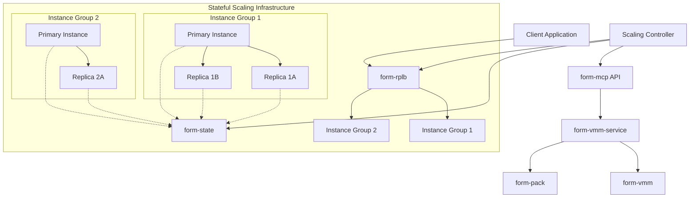
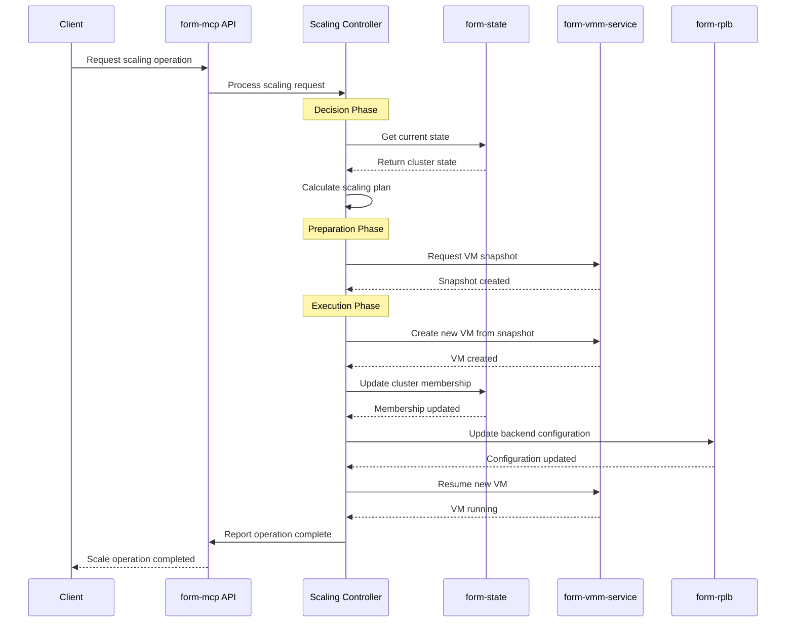
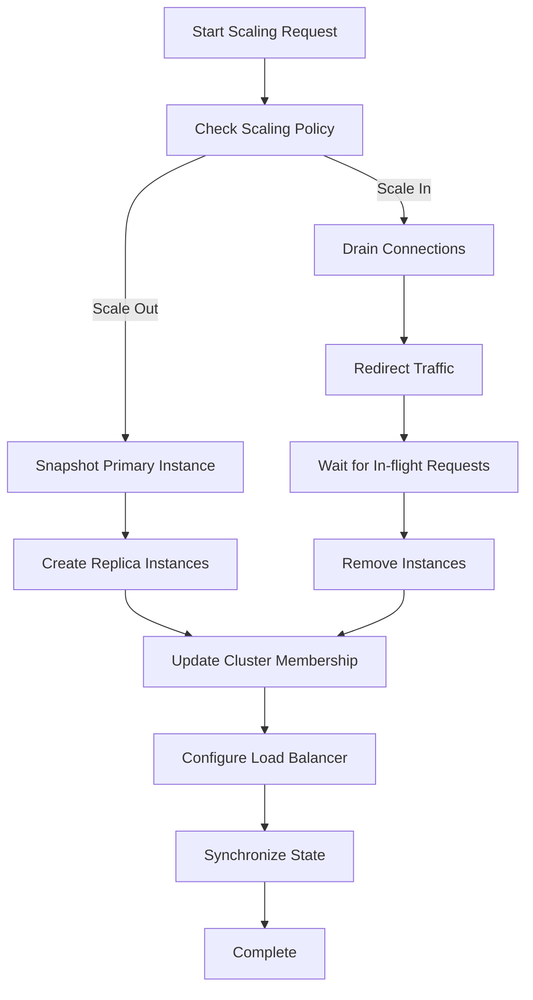
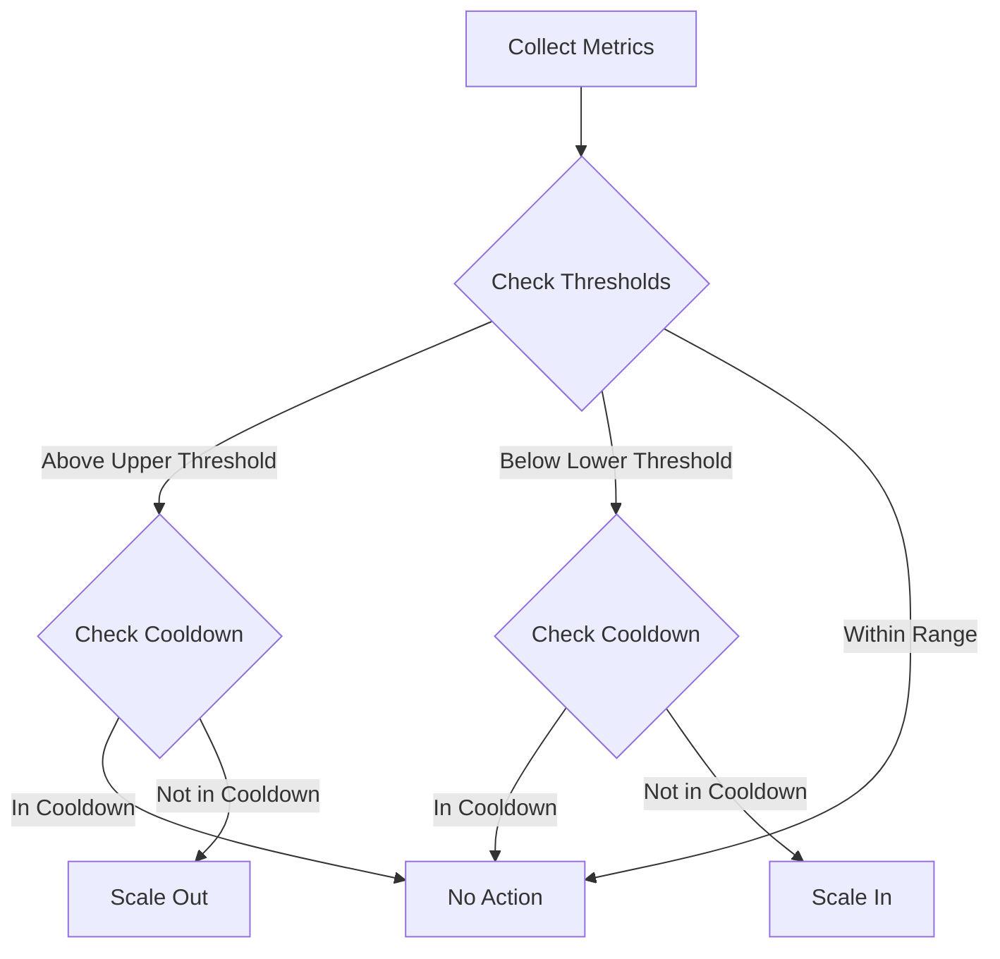

# Consensusless Stateful Elastic Scaling - Epic 7 Technical Design

## Overview

Consensusless Stateful Elastic Scaling enables dynamic, horizontal and vertical scaling of compute resources without losing application state, while avoiding complex consensus protocols. Our focus is on building a unique capability that allows applications to scale across multiple instances with preserved state using the existing CRDT-based infrastructure.

## Architecture Overview



## Core Principles

1. **Minimal Scope**: Each subtask addresses a specific, limited objective
2. **Self-contained**: Subtasks can be completed independently where possible
3. **Verification-driven**: Each subtask includes verification steps
4. **Functionality First**: Focus on core functionality before optimizations
5. **Consensusless**: State synchronization using CRDTs without heavy consensus protocols
6. **State Preservation**: Maintain application state during scaling operations
7. **Integration**: Leverage existing components wherever possible

## Existing Components Analysis

Our detailed codebase analysis revealed several key components that will form the foundation of our implementation:

### 1. State Management with CRDTs

The system uses CRDT-based state management through `form-state` for distributed consistency without consensus:

```rust
// from form-state/src/datastore.rs
pub type PeerMap = Map<String, BFTReg<CrdtPeer<String>, String>, String>;
pub type CidrMap = Map<String, BFTReg<CrdtCidr<String>, String>, String>;
pub type AssocMap = Map<String, BFTReg<CrdtAssociation<String>, String>, String>;
pub type DnsMap = Map<String, BFTReg<CrdtDnsRecord, String>, String>;
pub type InstanceMap = Map<String, BFTReg<Instance, String>, String>;
pub type NodeMap = Map<String, BFTReg<Node, String>, String>;
pub type AccountMap = Map<String, BFTReg<Account, String>, String>;
```

The `DataStore` struct combines these CRDT maps to maintain a complete system state:

```rust
#[derive(Clone, Debug, Serialize, Deserialize)]
pub struct DataStore {
    pub network_state: NetworkState,
    pub instance_state: InstanceState,
    pub node_state: NodeState,
    pub account_state: AccountState,
}
```

### 2. Instance Clustering

The `InstanceCluster` implementation manages membership and state:

```rust
// from form-state/src/instances.rs
#[derive(Clone, Default, Debug, Serialize, Deserialize, PartialEq, Eq, PartialOrd, Ord, Hash)]
pub struct InstanceCluster {
    pub members: BTreeMap<String, ClusterMember>
}

#[derive(Clone, Debug, Serialize, Deserialize, Hash, PartialEq, Eq, PartialOrd, Ord)]
pub struct ClusterMember {
    pub node_id: String,
    pub node_public_ip: IpAddr,
    pub node_formnet_ip: IpAddr,
    pub instance_id: String,
    pub instance_formnet_ip: IpAddr,
    pub status: String,
    pub last_heartbeat: i64,
    pub heartbeats_skipped: u32,
}
```

### 3. VM Snapshots and Migration

The Cloud Hypervisor snapshot capabilities include:

```bash
# Pause VM first
./ch-remote --api-socket=/tmp/cloud-hypervisor.sock pause

# Create snapshot
./ch-remote --api-socket=/tmp/cloud-hypervisor.sock snapshot file:///path/to/snapshot

# Restore from snapshot
./cloud-hypervisor --api-socket /tmp/cloud-hypervisor.sock --restore source_url=file:///path/to/snapshot
```

Snapshots contain:
- `config.json` - VM configuration
- `memory-ranges` - RAM contents
- `state.json` - VM device state

### 4. Load Balancing

`form-rplb` provides load balancing but currently uses only random selection:

```rust
// from form-rplb/src/proxy.rs
pub async fn select_backend(&self, domain: &str, protocol: Protocol) -> Result<SocketAddr, ProxyError> {
    // ...
    return backend.http.addresses().choose(&mut rand::thread_rng())
        .copied().ok_or_else(|| ProxyError::NoBackend(format!("Missing HTTP backend for {domain}")))
    // ...
}
```

## Implementation Architecture



## Detailed Task Breakdown

### 1. Instance Group Management Extensions

#### 1.1 Enhance `InstanceCluster` Data Structure

1.1.1. Extend InstanceCluster data structure
- Add scaling configuration to `InstanceCluster` struct:

```rust
// Example extension
pub struct ScalingPolicy {
    pub min_instances: u32,
    pub max_instances: u32,
    pub target_cpu_utilization: f32,
    pub scale_in_cooldown_seconds: u32,
    pub scale_out_cooldown_seconds: u32,
}

pub struct InstanceCluster {
    pub members: BTreeMap<String, ClusterMember>,
    pub scaling_policy: Option<ScalingPolicy>,
    pub template_instance_id: Option<String>,
    pub session_affinity_enabled: bool,
}
```

**Sub-subtasks breakdown:**

1.1.1.1: Define the ScalingPolicy struct ✅
- Create a new struct for scaling policies with fields for min/max instances, target utilization, and cooldown periods
- Add appropriate derives and implement any necessary traits
- Add documentation comments explaining each field's purpose
- Write unit tests for the struct

1.1.1.2: Add scaling fields to InstanceCluster ✅
- Extend the existing InstanceCluster struct with scaling_policy field
- Add template_instance_id field to identify the primary instance for scaling
- Add session_affinity_enabled boolean flag
- Update derives and implement any necessary traits for the extended struct
- Add documentation comments for new fields

1.1.1.3: Implement utility methods for ScalingPolicy ✅
- Added constructor method (new) for creating policies with specific parameters
- Added with_defaults() factory method for creating policies with sensible defaults
- Added parameter validation logic through validate() method
- Implemented methods to check if scaling actions are allowed (should_scale_out, should_scale_in)
- Added cooldown period management (is_in_scale_out_cooldown, is_in_scale_in_cooldown)
- Implemented record_scale_out and record_scale_in to track scaling operation timestamps
- Created get_target_instance_count method for calculating optimal instance count
- Added comprehensive accessor methods for all fields
- Created extensive unit tests for all added functionality

1.1.1.4: Update InstanceCluster implementation ✅
- Add getter/setter methods for new fields (scaling_policy, template_instance_id, session_affinity_enabled)
- Extend existing methods to handle scaling-related functionality
- Implement additional helper methods for scaling operations (should_scale_out, should_scale_in, select_instances_to_remove)
- Added validation methods for scaling policies
- Implemented proper constructors with scaling configuration options
- Created comprehensive unit tests for all new methods and functionality

1.1.1.5: CRDT integration verification ✅
- Verified proper CRDT handling for the new fields with serialization/deserialization tests
- Confirmed sequential updates to InstanceCluster fields work properly
- Identified and documented a limitation in the current CRDT implementation for handling concurrent modifications of collections (cluster members)
- Added a comprehensive test for sequential state modification that verifies proper serialization/deserialization
- Ensured backward compatibility with existing data structure

1.1.2. Enhance state transitions for scaling operations:

```rust
pub enum ScalingOperation {
    ScaleOut { target_count: u32 },
    ScaleIn { target_count: u32, instance_ids_to_remove: Vec<String> },
    ReplaceInstance { instance_id: String },
}

pub enum ScalingStatus {
    InProgress { operation: ScalingOperation, started_at: i64 },
    Completed { operation: ScalingOperation, completed_at: i64 },
    Failed { operation: ScalingOperation, error: String, failed_at: i64 },
}
```

#### 1.2 Implement Cluster Scaling Primitives



### 2. Stateful Workload Distribution

#### 2.1 Load Balancer Session Affinity

Extend `form-rplb` to support session affinity:

```rust
pub enum AffinityMethod {
    None,
    ClientIP,
    Cookie { name: String, ttl_seconds: u32 },
    ConsistentHashing { parameter: String },
}

impl ReverseProxy {
    pub async fn select_backend_with_affinity(
        &self, 
        domain: &str, 
        protocol: Protocol,
        client_ip: Option<IpAddr>,
        cookies: Option<HashMap<String, String>>,
        parameters: Option<HashMap<String, String>>,
    ) -> Result<SocketAddr, ProxyError> {
        let routes = self.routes.read().await;
        let backend = routes.get(domain)
            .ok_or_else(|| ProxyError::NoBackend(domain.to_string()))?;
            
        // Apply affinity logic based on backend configuration
        // ...
    }
}
```

#### 2.2 Connection Draining for Safe Scale-in

```rust
pub struct ConnectionDrainConfig {
    pub grace_period_seconds: u32,
    pub wait_for_connections: bool,
    pub notify_clients: bool,
}

impl ReverseProxy {
    pub async fn drain_connections(
        &self,
        domain: &str,
        backend_addr: SocketAddr,
        config: ConnectionDrainConfig,
    ) -> Result<(), ProxyError> {
        // Implementation for graceful connection draining
        // ...
    }
}
```

### 3. Consensusless State Synchronization

Leverage existing CRDT implementation and extend it:

```rust
// Example extension for optimized state replication
pub enum StateReplicationPolicy {
    FullSync,
    DeltaSync,
    PrioritizedSync { high_priority_fields: Vec<String> },
}

pub struct StateReplicationConfig {
    pub policy: StateReplicationPolicy,
    pub batch_size: usize,
    pub sync_interval_ms: u32,
}
```

### 4. Horizontal Scaling Operations

#### 4.1 Scaling Decision Engine



#### 4.2 Snapshot-based Scale-out Implementation

```rust
pub async fn scale_out_cluster(
    &self,
    cluster_id: &str,
    additional_instances: u32,
) -> Result<ScalingOperationId, ScalingError> {
    // 1. Get cluster config and current state
    let cluster = self.get_cluster(cluster_id).await?;
    
    // 2. Identify primary instance for template
    let primary = self.identify_primary_instance(&cluster).await?;
    
    // 3. Create snapshot of primary
    let snapshot_id = self.create_instance_snapshot(primary.instance_id).await?;
    
    // 4. Launch new instances from snapshot
    let mut new_instances = Vec::new();
    for _ in 0..additional_instances {
        let instance_id = self.launch_instance_from_snapshot(snapshot_id).await?;
        new_instances.push(instance_id);
    }
    
    // 5. Update cluster membership
    self.add_instances_to_cluster(cluster_id, new_instances).await?;
    
    // 6. Update load balancer configuration
    self.update_load_balancer_config(cluster_id).await?;
    
    // 7. Return operation ID for tracking
    Ok(ScalingOperationId::new())
}
```

### 5. Failover and Health Monitoring

#### 5.1 Health Assessment

```rust
pub enum HealthStatus {
    Healthy,
    Degraded { reason: String },
    Unhealthy { reason: String },
}

pub struct InstanceHealth {
    pub instance_id: String,
    pub status: HealthStatus,
    pub last_heartbeat: i64,
    pub metrics: SystemMetrics,
    pub history: Vec<HealthStatusChange>,
}

pub async fn assess_cluster_health(
    &self,
    cluster_id: &str,
) -> Result<ClusterHealth, HealthCheckError> {
    // Implementation for comprehensive health check
    // ...
}
```

### 6. Scaling API and CLI

```rust
// API Endpoints
POST /api/v1/clusters/{cluster_id}/scale
{
    "operation": "scale_out", // or "scale_in"
    "target_count": 5,
    "immediate": false,
    "drain_connections": true
}

GET /api/v1/clusters/{cluster_id}/status
{
    "cluster_id": "cluster-123",
    "instances": 3,
    "scaling_status": "stable",
    "health_status": "healthy",
    "last_operation": {
        "type": "scale_out",
        "completed_at": "2023-07-01T10:15:30Z",
        "status": "completed"
    }
}
```

## Implementation Timeline

### Phase 1: Foundation (Weeks 1-2)
- Extend InstanceCluster for scaling operations
- Enhance instance group state management
- Implement basic snapshot-based scaling

### Phase 2: Core Functionality (Weeks 3-4)
- Implement session affinity in load balancer
- Create scaling decision engine
- Implement horizontal scaling operations API

### Phase 3: Enhanced Features (Weeks 5-6)
- Add connection draining for scale-in
- Implement automated failover
- Add vertical scaling capabilities

### Phase 4: Refinement (Weeks 7-8)
- Implement rollback mechanisms
- Add detailed metrics and monitoring
- Performance tuning and optimization

## Initial Focus

For the first implementation sprint, we will focus on:

1. Enhancing `InstanceCluster` with scaling properties
2. Implementing snapshot-based instance cloning
3. Adding session affinity to the load balancer
4. Creating basic horizontal scaling API endpoints

This provides the foundation for the more complex aspects of the system while delivering immediate value and allowing for iterative improvement. 