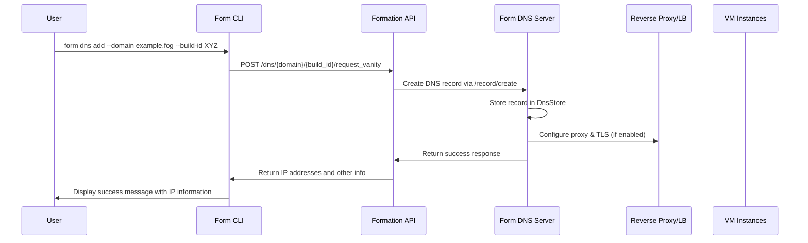
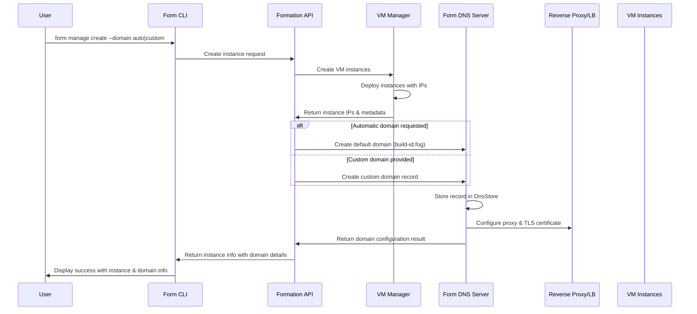
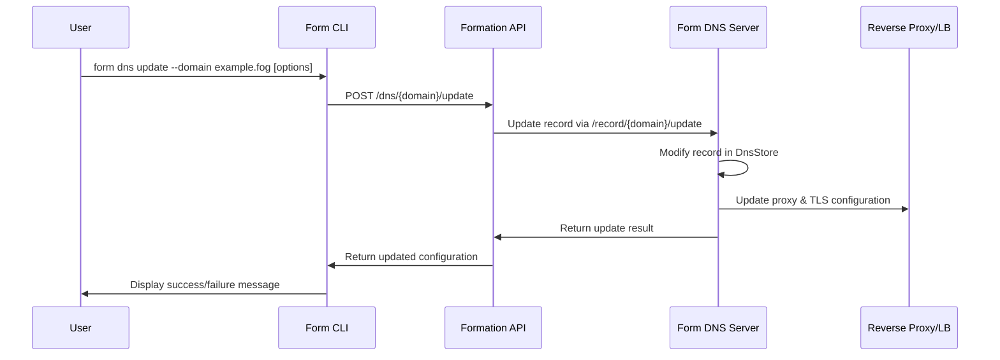
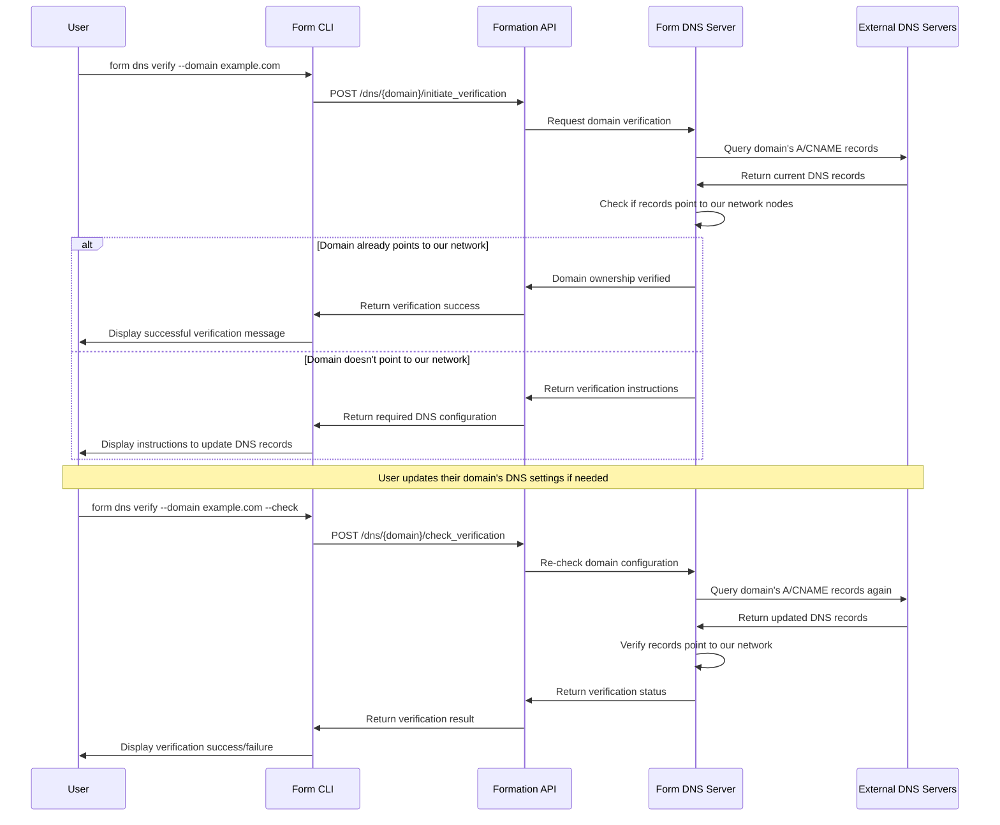
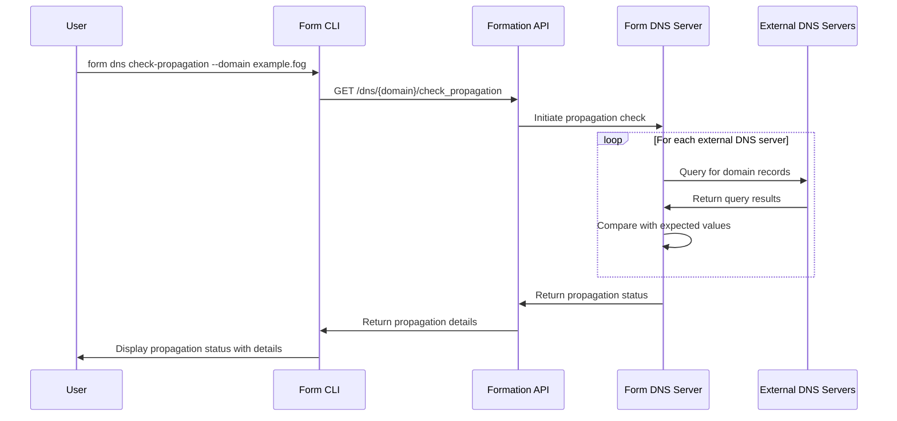
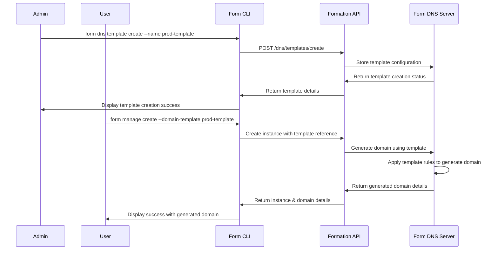

# Vanity Domain Provisioning Sequence Diagrams

This document provides sequence diagrams for the key workflows in the Vanity Domain Provisioning feature. These diagrams help visualize how components interact and serve as a reference for implementation.

## 1. Current Implementation: Manual Domain Registration

The following diagram shows the current implemented flow for manually adding a domain:

## 2. Target Implementation: Automatic Domain Provisioning

The following diagram shows how automatic domain provisioning should work with instance creation:

## 3. Domain Update Workflow

This diagram shows the flow for updating an existing domain:

## 4. Domain Verification Workflow

This diagram shows the proposed flow for verifying ownership of custom domains:

## 5. DNS Propagation Check Workflow

This diagram shows the proposed flow for checking DNS propagation:

## 6. Domain Templates Workflow

This diagram shows the proposed flow for organization domain templates:

These sequence diagrams provide a clear visualization of how the Vanity Domain Provisioning feature should work in both its current state and its target implementation. They will serve as a guide for implementing the remaining tasks and ensuring proper integration between components. 